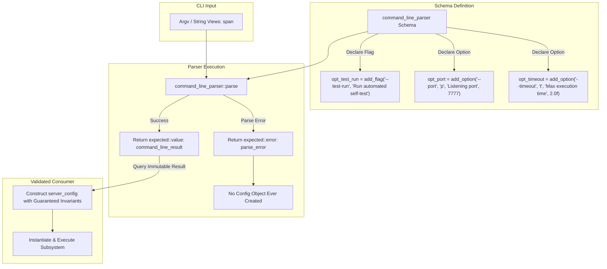

# Proposal: Unified Zero-Allocation Result-Producing Command Line Argument Parser

## Status
Proposed

## Context
Across Tempest entry points (`engine/runtime/runner/src/main.cpp`, `engine/runtime/server/src/main.cpp`, and test runners), command-line argument processing is currently implemented via manual string comparison loops (`starts_with`, `substr`) and ad-hoc numeric conversions.

A common pattern in traditional CLI libraries is **mutable pointer binding** (e.g. `add_option("--port", &config.port)`). However, pointer-binding approaches introduce critical state safety risks:
1. **Partial / Corrupted Object State**: If parsing fails midway through evaluating arguments (e.g. an invalid numerical string or unrecognized token), the target structure is left partially mutated.
2. **Use-After-Parse-Failure Bugs**: Because the configuration object is instantiated *before* parsing, calling code can inadvertently consume an invalid or unvalidated object when error checks are omitted or misordered.
3. **Implicit Invariant Violation**: Engine invariants demand that objects represent valid states upon construction. Binding raw pointers encourages uninitialized or dummy instances waiting to be populated.

---

## Core Architectural Principle: Result-Producing Parse

The parser follows a **strict result-producing design**:
- The parser does **not** bind to pre-existing mutable variables.
- `parser.parse(...)` returns `tempest::expected<command_line_result, parse_error>`.
- The application configuration object is constructed **only after** validation succeeds, using the immutable, fully validated `command_line_result`.



---

## Architectural Comparison

| Design Property | Pointer-Binding (Rejected) | Result-Producing (Proposed) |
| :--- | :--- | :--- |
| **Object Lifetime** | Target object exists before parsing begins | Target object is constructed *only* after validation passes |
| **Error Safety** | Object may be left partially mutated on error | No invalid or partially initialized state can ever exist |
| **Immutability** | Target members are exposed to mutable pointer writes | `command_line_result` is strictly `const` after parse |
| **Default Handling** | Relies on default member initializers of external struct | Schema explicitly declares and documents defaults |
| **Type Safety** | Pointers may alias or outlive stack frames | Strongly typed option handles (`option_id<T>`, `flag_id`) |

---

## Technical Specifications

### 1. Header Location & Module Placement
The parser will reside in `engine/runtime/core`:
- Header: `engine/runtime/core/include/tempest/command_line_parser.hpp`
- Implementation: `engine/runtime/core/src/command_line_parser.cpp`

### 2. Error Diagnostics (`parse_error`)
```cpp
namespace tempest::core
{
    enum class parse_error_code : uint8_t
    {
        none = 0,
        unknown_option,
        missing_value,
        invalid_value_format,
        missing_required_argument,
        value_out_of_range,
        help_requested,
    };

    struct parse_error
    {
        parse_error_code code = parse_error_code::none;
        string_view option_name = {};
        string_view error_detail = {};
    };
}
```

### 3. Strongly Typed Option Identifiers
To prevent stringly-typed lookup overhead and typographical errors at retrieval time, the schema returns strongly-typed identifiers:

```cpp
namespace tempest::core
{
    struct flag_id
    {
        size_t index = 0;
    };

    template <typename T>
    struct option_id
    {
        size_t index = 0;
    };

    template <typename T>
    struct positional_id
    {
        size_t index = 0;
    };
}
```

### 4. Immutable Result Container (`command_line_result`)
`command_line_result` holds the validated arguments. It cannot be constructed directly by users; it is strictly produced by `command_line_parser::parse()`:

```cpp
namespace tempest::core
{
    class command_line_result
    {
      public:
        /// \brief Checks if a boolean flag was supplied on the command line.
        [[nodiscard]] auto has(flag_id flag) const noexcept -> bool;

        /// \brief Retrieves a typed option value by its identifier (uses default if omitted).
        template <typename T>
        [[nodiscard]] auto get(option_id<T> opt) const noexcept -> const T&;

        /// \brief Retrieves an optional value (empty if non-required option had no default).
        template <typename T>
        [[nodiscard]] auto get_optional(option_id<T> opt) const noexcept -> optional<T>;

        /// \brief Retrieves a positional argument value.
        template <typename T>
        [[nodiscard]] auto get(positional_id<T> pos) const noexcept -> const T&;

        /// \brief Name-based fallback lookup.
        [[nodiscard]] auto has_flag(string_view name) const noexcept -> bool;

        template <typename T>
        [[nodiscard]] auto get(string_view name) const noexcept -> optional<T>;

      private:
        friend class command_line_parser;
        // Internal parsed value storage (variant-free, arena or fixed chunk buffers)
    };
}
```

### 5. Parser Schema Definition API
```cpp
namespace tempest::core
{
    class command_line_parser
    {
      public:
        command_line_parser(string_view program_name, string_view description = {});

        /// \brief Declares a boolean flag (e.g. --test-run or -v).
        auto add_flag(string_view long_name, char short_name, string_view description) -> flag_id;
        auto add_flag(string_view long_name, string_view description) -> flag_id;

        /// \brief Declares an option with a default value.
        template <typename T>
        auto add_option(string_view long_name, char short_name, string_view description, T default_value) -> option_id<T>;

        template <typename T>
        auto add_option(string_view long_name, string_view description, T default_value) -> option_id<T>;

        /// \brief Declares a required option without default.
        template <typename T>
        auto add_required_option(string_view long_name, char short_name, string_view description) -> option_id<T>;

        /// \brief Declares a positional argument.
        template <typename T>
        auto add_positional(string_view name, string_view description, bool required = true) -> positional_id<T>;

        /// \brief Parses argument list over a span of string_views, producing a validated result.
        [[nodiscard]] auto parse(span<const string_view> args) const -> expected<command_line_result, parse_error>;

        /// \brief Parses classic argc/argv entry point arguments.
        [[nodiscard]] auto parse(int argc, char* const argv[]) const -> expected<command_line_result, parse_error>;

        /// \brief Emits auto-generated formatted usage banner.
        auto print_help(logger& log) const -> void;
        auto print_help() const -> void;
    };
}
```

---

## Example Usage: `tempest-server` Entry Point

```cpp
auto main(int argc, char* argv[]) -> int
{
    auto parser = tempest::core::command_line_parser("tempest-server", "Tempest Headless Dedicated Server");

    // 1. Declare schema and obtain strongly-typed IDs
    const auto flag_test_run = parser.add_flag("--test-run", "Execute self-terminating test loop");
    const auto opt_timeout   = parser.add_option<float>("--timeout", 't', "Test run timeout in seconds",
                                                        tempest::server::server_config::default_test_timeout_seconds);
    const auto opt_port      = parser.add_option<uint16_t>("--port", 'p', "UDP listening port",
                                                           tempest::server::server_config::default_port);
    const auto opt_timestep  = parser.add_option<float>("--fixed-timestep", 'd', "Fixed simulation delta time in seconds",
                                                        tempest::server::server_config::default_fixed_timestep);

    // 2. Parse arguments: Produces result or typed error
    const auto parse_result = parser.parse(argc, argv);
    if (!parse_result)
    {
        if (parse_result.error().code == tempest::core::parse_error_code::help_requested)
        {
            parser.print_help();
            return 0;
        }

        // Diagnostic output for invalid input
        return 1;
    }

    const auto& cli = *parse_result;

    // 3. Construct target config ONLY after parsing succeeds with guaranteed valid invariants
    const auto config = tempest::server::server_config{
        .port = cli.get(opt_port),
        .fixed_timestep = cli.get(opt_timestep),
        .test_run = cli.has(flag_test_run),
        .test_timeout_seconds = cli.get(opt_timeout),
    };

    auto server = tempest::server::server_context(config);
    return server.run();
}
```

---

## Verification Plan

1. **Automated Unit Tests (`command_line_parser_test`)**:
   - `result_producing_invariant`: Verify target configuration cannot be instantiated if input is malformed.
   - `typed_id_retrieval`: Assert `cli.get(option_id<T>)` returns exact types (`uint16_t`, `float`, `string_view`) without runtime casting.
   - `defaults_preservation`: Verify omitting an option accurately resolves to its schema-declared default value.
   - `required_options_validation`: Verify omitting a required option returns `missing_required_argument` without producing a result.
   - `boundary_and_error_handling`: Test malformed numbers, negative ports, and trailing arguments.
2. **Help Generation**:
   - Verify `--help` and `-h` return `parse_error_code::help_requested` and emit clean tabular help.
