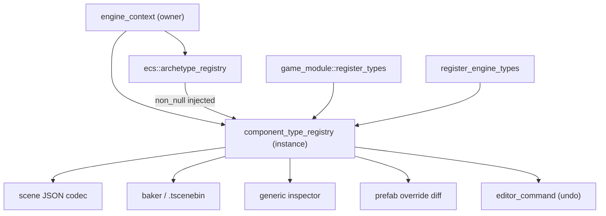

# Proposal: Component Reflection & Injected Component Type Registry

## Status
Proposed. Child of [Editor & Scene System](editor_and_scene_system.md), Milestone M1.

## Context
Scene files, prefab overrides, the generic inspector, the baker and undo/redo all need to know about each component's fields at runtime. Today:

- Components are serialized by `memcpy`. `component_serializer` (in `asset_database.hpp`) is keyed by `core::type_hash<T>`.
- Inspectors are written by hand for each type (`component_view_provider`).
- The archetype registry gets dense type indices from `detail::get_archetype_type_index(string_view)` (`archetype.cpp:267`). That function holds a **function-local static** `flat_unordered_map<string, size_t>` and a static counter. The header adds a second layer of `static const size_t index` caches per template instantiation (`archetype.hpp:48-51, 1063, 1197`). This is global mutable state, which AGENTS.md prohibits. Every shared library (`tempest.dll`, `editor-core.dll`, `game-runtime.dll`) also gets its own copy of the header-level caches.
- Type names come from compiler pretty-function strings (`core::get_type_name<T>()`). `meta_test.cpp` pins two non-template structs in the global namespace. MSVC `__FUNCSIG__` emits elaborated keywords (`struct`, `class`, `enum`) *inside* template arguments, and MSVC and Clang format spacing differently. `get_type_name` only strips the leading keyword. So types like `relationship_component<entity>` are expected to produce different names on the two compilers, and no test covers this today.

---

## Proposed Architecture



## Detailed Design

### 1. Dependency-Injected `component_type_registry`

`component_type_registry` lives in the `ecs` library. It is an ordinary class: it has no static state, and the engine context (or a test fixture) owns its instance. The archetype registry receives it at construction. This follows the existing `event::event_registry&` injection pattern.

```cpp
namespace tempest::ecs
{
    class component_type_registry
    {
      public:
        static constexpr size_t max_component_types = 256; // archetype bitmask width

        // Storage-only registration: name, size, alignment, duplicate policy.
        template <component T>
        auto register_type() -> component_type_id;

        // Storage + field reflection via reflect<T>.
        template <reflected_component T>
        auto register_reflected() -> component_type_id;

        // Registers T as storage-only if it is unknown. Used by archetype_registry on first use.
        template <component T>
        auto ensure() -> component_type_id;

        template <component T>
        [[nodiscard]] auto find() const noexcept -> optional<component_type_id>;

        [[nodiscard]] auto find(string_view normalized_name) const noexcept -> optional<component_type_id>; // alias-aware
        [[nodiscard]] auto info(component_type_id id) const noexcept -> const component_type_info&;

        auto add_alias(string_view legacy_name, string_view current_name) -> void;

        [[nodiscard]] auto schema_hash() const noexcept -> uint64_t;    // serializable types only
        [[nodiscard]] auto export_manifest() const -> type_manifest;    // golden-test input

      private:
        vector<component_type_info> _types;                       // indexed by component_type_id
        flat_unordered_map<uint64_t, component_type_id> _by_hash; // normalized-name FNV-1a 64
        flat_unordered_map<uint64_t, uint64_t> _aliases;          // legacy hash -> current hash
    };

    template <typename EntityType>
    class basic_archetype_registry
    {
      public:
        basic_archetype_registry(event::event_registry& events, component_type_registry& types);
        // ...
      private:
        non_null<component_type_registry> _types;
    };
}
```

- **Ownership.** `standalone_engine_context` owns a `component_type_registry _component_types`, declared *before* `_entity_registry` so it is destroyed after it. `server_context`, the baker and the tests each own their own instance. Every DLL gets types from the injected instance, so all modules agree on the indices.
- **Lookup.** `assign<T>`, `get<T>`, `has<T>` and similar resolve `T` through `_types->ensure<T>()`. That is one `flat_unordered_map` probe keyed by `normalized_type_hash_v<T>`, a `constexpr` FNV-1a 64 of the normalized name. View construction (`with<Ts...>()`) and archetype hash construction resolve their indices once per call. The static `get_archetype_type_index` overloads and every `static const` index cache in `archetype.hpp` are deleted.
- **Lazy registration.** `ensure<T>()` keeps today's ergonomics: ad-hoc test structs work without being registered first. A lazily registered type is storage-only. It cannot be serialized, inspected or diffed, and saving or baking an entity that has one reports `unserializable component <name>`.
- **Hash collisions.** If two different normalized names hash to the same value, registration asserts and logs both names.
- **Capacity.** Registering type number 257 is a hard error that names the offending type.
- **Snapshots.** Snapshots (see [Editor Authoring & Play Mode](editor_authoring_and_play_mode.md)) share the same injected instance. Type ids are stable for the lifetime of the type registry.
- **Follow-up (out of scope).** `core::detail::type_index::next()` and `type_info::instance` in `meta.hpp:262-268, 466-469, 530` are also static mutable state. The ECS stops depending on them in M1. Removing them from `core` is recorded as a follow-up.

### 2. Normalized Type Names

`normalized_type_name<T>()` is `consteval`. It post-processes `core::get_type_name<T>()` into a fixed-size buffer:

1. Remove `struct `, `class `, `enum ` and `union ` wherever they appear as whole words, not only at the start.
2. Remove whitespace after `,` and between consecutive `>` characters.
3. Reject types declared in anonymous namespaces and function-local types (`static_assert` in `register_reflected`). Their pretty names are not portable.

The name is used as-is as the JSON component key. Its FNV-1a 64 hash is the binary identity.

### 3. Type-Identity Gate (cross-toolchain guarantee)

The literal-name tests in `meta_test.cpp` are the right mechanism. Every test target is built and run on Ninja+Clang, MSVC v143 and MSVC v145 (AGENTS.md §3), and each one asserts the same literal string. If all three pass, the three toolchains produce identical names. The gate is extended in two ways so that it covers what scene files actually store:

| Layer | Target | What it pins |
| :--- | :--- | :--- |
| **Shape tests** | `core-tests` (`meta_test.cpp`) | Literal normalized names for: a namespaced struct, a nested namespace, a class with private members, a template with an `enum class` argument (`relationship_component<entity>`), a template with several type arguments, nested templates (`a<b<c>>`), and a type with a `const` qualifier. |
| **Golden manifest** | `tempest-tests` (engine types), new `game-tests` (game types) | Each test calls the **same** `register_engine_types(component_type_registry&)` / `game_module::register_types` functions that production startup calls. It exports the manifest (normalized name, size, alignment, version, fields {name, kind, offset}) and compares it byte-for-byte with a committed `type_manifest.golden.json`. |
| **Runtime** | baker, runner | `schema_hash` in `.tscenebin` headers, plus alias-aware JSON loading. |

Sharing the registration function means a new component appears in the golden manifest automatically. A rename or layout change then fails the test, and the failure message explains how to fix it: add an alias or a migration, then regenerate the golden file with `--update-golden`.

### 4. `reflect<T>` Field Descriptors

```cpp
namespace tempest::ecs
{
    enum class field_kind : uint8_t
    {
        boolean, int32, uint32, int64, uint64, float32, float64,
        vec2, vec3, vec4, quat, color3, color4,
        guid, entity_ref, asset_ref, enumeration, fixed_string,
    };

    enum class field_flags : uint8_t
    {
        none = 0,
        transient = 1 << 0, // not serialized; reset to default on load
        read_only = 1 << 1, // shown in inspector, not editable
        hidden = 1 << 2,    // serialized, not shown
    };

    struct field_ui_hints
    {
        static constexpr float default_speed = 0.1F;

        optional<double> min_value = nullopt;
        optional<double> max_value = nullopt;
        float drag_speed = default_speed;
        string_view units = {};
    };

    struct field_descriptor
    {
        static constexpr size_t no_offset = ~size_t{0};

        string_view name;
        field_kind kind;
        field_flags flags;
        size_t offset;            // no_offset for accessor fields
        uint64_t asset_type_hash; // asset_ref only (asset type canonical-name hash)
        span<const enum_entry> enum_entries;
        field_ui_hints hints;
        auto (*get)(const void* component, void* out_value) -> void;
        auto (*set)(void* component, const void* in_value) -> void;
    };
}
```

Example. The `reflect` specialization is a `friend`, so it can reflect private members directly:

```cpp
template <>
struct tempest::ecs::reflect<tempest::ecs::transform_component>
{
    static constexpr uint32_t version = 1;

    static auto describe(type_builder<transform_component>& builder) -> void
    {
        builder.field("position", &transform_component::_position)
            .field("rotation", &transform_component::_rotation)
            .field("scale", &transform_component::_scale)
            .post_load([](transform_component& transform) { transform._build_transform(); });
    }
};
```

Rules:

- `entity_ref` fields must be member fields, so they have an offset. The baker and the loader patch them in raw component bytes.
- Accessor fields (getter/setter lambdas) are allowed for computed views, but they are excluded from raw patching.
- Derived or cached data (such as `_transform`) is not a field. `post_load` rebuilds it after JSON load and after raw bake load.
- Component-level policy: `serializable` (default `true`), `duplicatable` (replaces today's `should_duplicate`), and `editor_only`.
- Initial engine policy:

| Component | Policy |
| :--- | :--- |
| `self_component` | Not serializable. |
| `relationship_component` | Not serializable. The hierarchy is stored structurally instead. |
| `transform_history_component` | Not serializable. |
| `velocity_component` | Not serializable. |
| `character_controller_component` | Serializable. Its runtime fields (`character_id`, grounded state, ground normal) are `transient`. |

### 5. Migration Hooks

```cpp
static constexpr uint32_t version = 2;
static auto migrate(uint32_t from_version, json_object_mut& data) -> expected<void, migration_error>;
```

The JSON codec calls `migrate` in a loop from the stored version up to the current one before it decodes fields. Each saved component records its version.

## Public API Surface & Subsystem Invariants
- **No globals.** There is no `static` or `thread_local` mutable state anywhere in `ecs` type resolution.
- **Single source of truth.** One `component_type_registry` instance per world. All DLLs resolve through the instance injected into them.
- **Same ids everywhere.** Type ids never escape a process. Files store normalized names (JSON) or name hashes (binary).
- `basic_archetype_registry`'s constructor takes two required arguments, so it is not `explicit`, per AGENTS.md.

## Verification Plan
- **`core-tests`:** the shape tests from §3, plus a check that `normalized_type_hash_v<T>` equals a runtime FNV-1a of the normalized literal.
- **`ecs-tests`:**
  - Two registries with **separate** type registries assign independent indices.
  - Two registries with a **shared** type registry agree on indices.
  - `ensure<T>` is idempotent.
  - Registering type 257 fails.
  - A hash collision is detected (inject a test hasher).
  - Field get/set round-trips for member and accessor fields.
  - `post_load` runs.
  - Alias lookup works.
  - Existing archetype tests pass unchanged once moved to the fixture-owned type registry.
- **`tempest-tests` / `game-tests`:** golden manifest comparison.
- **Static audit:** `git grep -n "static" engine/runtime/ecs/src engine/runtime/ecs/include` returns no mutable statics in type resolution.
- **TSan:** not required (no concurrency changes). Registration happens on the main thread before any jobs are scheduled.
- **Performance:** `ecs-tests` adds an `assign`/`get` micro-benchmark (1M operations) comparing before and after. Fail if the regression exceeds 10%. If it does, add a small per-registry direct-mapped cache keyed by type hash.

## Implementation Phases
| Phase | Subsystem | Description |
| :--- | :--- | :--- |
| 1 | core | `consteval` name normalization plus shape tests |
| 2 | ecs | `component_type_registry`, constructor injection, removal of static index caches, migration of all registry construction sites |
| 3 | ecs | `reflect<T>`, `type_builder`, field descriptors, engine component reflections, golden manifest test |
| 4 | assets | Retire the `memcpy`-based `component_serializer` and `register_component<T>`, and switch to the type registry |
