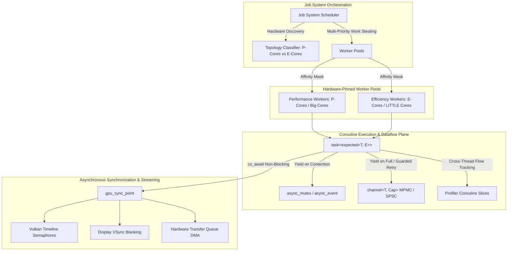
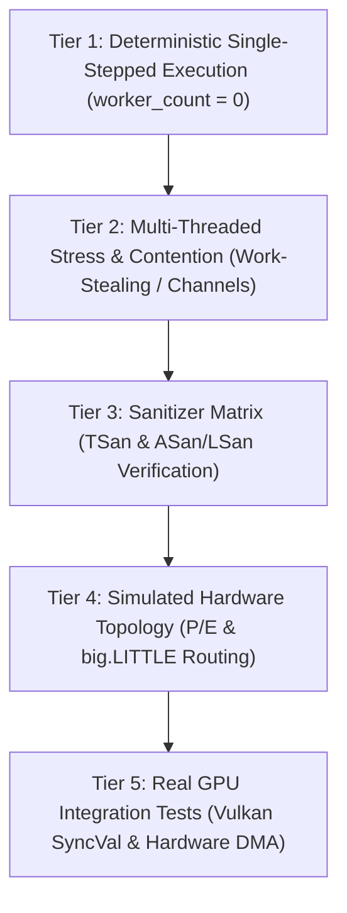

# Proposal: Coroutine-Native Job System

## Status
Proposed

## Context
As Tempest scales towards complex scene graphs, clustered lighting, dynamic visibility, virtual geometry, and texture streaming, CPU bottlenecks shift from single-threaded execution to work orchestration, synchronization latency, and command buffer recording.

Traditional engine job systems rely on thread-first worker pools and coarse job counters (`std::atomic<uint32_t>`). When tasks need to wait on other tasks, I/O, or GPU resources, thread-first primitives (such as `std::mutex` or `std::condition_variable`) block OS worker threads, leading to thread starvation, priority inversion, and sneaky deadlocks. Furthermore, standard profilers assume synchronous RAII call stacks tied to a single OS thread, failing when tasks suspend on Worker Thread A and resume on Worker Thread B.

This proposal designs an asynchronous, coroutine-native job system in Tempest based on C++20 coroutines, `tempest::expected`, lock-free work-stealing schedulers with hardware topology affinity (ARM big.LITTLE and Intel P/E cores), coroutine-aware synchronization, and non-blocking GPU synchronization points.

---

## Proposed Architecture



---

## Detailed Design

### 1. Profiler Coroutine Awareness (Cross-Thread Suspension & Resumption)

#### The Problem
Tempest's current `thread_profiler_context` uses an RAII zone stack (`_open_zones`). When a coroutine suspends:
- Leaving the zone open across suspension pollutes Thread A's zone stack while Thread A executes unrelated tasks.
- Resuming on Thread B and popping the zone corrupts Thread B's stack.

#### Dual-Model Execution Slices & Flow Graph
1. **Physical Zone Slices (Enriched Zone Records)**:
   - Every contiguous execution of a coroutine between suspension points is recorded as an independent `zone_record` on the executing worker thread, enriched with `coroutine_id`, `slice_index`, and `suspend_reason`.
   - On `await_suspend()`, the active slice is closed on the current thread and tagged with `suspend_reason` (e.g. `channel_full`, `mutex_contention`, `timeline_wait`, `cancellation`).
   - On `await_resume()`, the resuming thread opens a new slice for `coroutine_id` with `slice_index + 1`.
2. **Web Profiler UX (Rule #25 Compliance)**:
   - **Physical View**: Displays slices on Thread A and Thread B. Hovering or clicking a slice dynamically links matching `coroutine_id`s in the web UI (`app.js`) to render a cross-thread Bézier **flow arrow** connecting Thread A's suspension to Thread B's resumption with duration and suspend reason pills.
   - **Logical Coroutine View**: Synthesized on-demand by the frontend, aggregating all slices of a coroutine into a single unified lane: active execution segments (colored by worker core) and suspended wait intervals (hatched gray, labeled by awaited object).

---

### 2. Coroutine-Aware Synchronization Primitives & Cancellation

Thread-blocking primitives (`std::mutex`, `std::condition_variable`) must not be used within coroutines. The engine provides non-blocking, coroutine-aware equivalents:

#### `async_mutex`
- **Fast Path**: Single atomic CAS `0 -> 1`. If uncontended, `await_ready()` returns `true` (zero heap allocation, zero yield).
- **Contended Path**: Intrusively enqueues `coroutine_handle<>` into an atomic waiter stack and suspends, yielding the worker thread back to the scheduler.
- **Unlock**: Pops the next waiting coroutine and dispatches it to the job queue matching its core affinity.

#### `async_event` & `async_counting_semaphore`
- Supports signaling from non-coroutine threads (such as OS I/O or Vulkan presentation callbacks) without thread stalls.

#### Cooperative Task Cancellation (`cancellation_token`)
- Tasks accept an optional `cancellation_token` or inherit one from their parent task graph.
- Awaitables (`channel.push`, `channel.pop`, `async_mutex`, `gpu_sync_point`) register with the token upon suspension.
- If cancellation is requested while suspended, the awaitable awakens the coroutine immediately, causing `await_resume()` to return `unexpected(error_code::task_canceled)`.

---

### 3. Coroutine Channels: Guarded Retry & Bounded Backpressure

Reader-writer queues are replaced with coroutine channels:

#### Guarded Yield / Retry Loop
When a channel is full:
1. Producer registers on `producer_waiters` and suspends (`co_await channel.push(val)`).
2. When a consumer reads a slot, it signals a waiting producer.
3. Upon resumption, the producer does **not** blindly write; it executes a guarded `try_push()` CAS. If a competing producer filled the slot first, it yields again.

#### Topology & Buffer Management Strategy
- **Strictly Bounded Capacity**: Channels use fixed circular ring buffers (compile-time fixed or dynamic initial capacity). Channels **never dynamically grow** at runtime, strictly enforcing backpressure to eliminate unbounded memory spikes.
- **`channel<T, Capacity = dynamic>`**: Default bounded MPMC channel using slot sequence tickets (Vyukov bounded queue).
- **`spsc_channel<T, Capacity>`**: High-throughput single-producer single-consumer policy using acquire-release atomic head/tail pointers without CAS or cache-line bouncing (1–3 ns/op for dedicated pipeline stages).

---

### 4. Expected-Based Error Handling & Coroutine Frame Memory

In accordance with Tempest's `-fno-exceptions` policy, coroutines wrap `tempest::expected<T, E>` in their promise:

```cpp
template <typename T, typename E = error_code>
class [[nodiscard]] task
{
public:
    struct promise_type
    {
        expected<T, E> result;

        // Custom slab-allocated coroutine frame memory
        auto operator new(size_t size) -> void*;
        auto operator delete(void* ptr, size_t size) noexcept -> void;

        auto get_return_object() noexcept -> task;
        auto initial_suspend() noexcept -> suspend_always;
        auto final_suspend() noexcept -> final_awaiter;

        auto return_value(T value) noexcept -> void;
        auto return_value(unexpected<E> err) noexcept -> void;
        auto return_value(expected<T, E> res) noexcept -> void;

        auto unhandled_exception() noexcept -> void { TEMPEST_ASSERT(false, "Unreachable"); }
    };
};
```

#### Multi-Tiered Size-Class Coroutine Frame Allocator
Unlike stackful fibers (which require 64KB–512KB dedicated stacks to handle arbitrary call trees), C++20 stackless coroutines execute on the host thread's normal OS stack, storing only variables that live across a `co_await` in their coroutine frame. To eliminate internal fragmentation while guaranteeing zero heap lock contention, each worker thread maintains a **multi-tiered power-of-two slab allocator**:

| Class | Slot Size | Typical Payload |
| :--- | :--- | :--- |
| **Class 0** | **64 B** | Trivial tasks, empty `task<void>` with single primitive wait. |
| **Class 1** | **128 B** | Standard async jobs, single `co_await`, handles, primitive state. |
| **Class 2** | **256 B** | Typical render passes, `expected<T, E>` with small descriptors. |
| **Class 3** | **512 B** | Tasks holding multiple resource handles or lambdas with small captures. |
| **Class 4** | **1024 B** | Wide parameter packs, structured concurrency tuples (`when_all`). |
| **Class 5** | **2048 B** | Heavy lambdas capturing substantial state across suspension. |
| **Overflow**| **> 2048 B**| Direct fallback to general engine heap (`tempest::memory::allocate`). |

- **Allocation**: $O(1)$ lock-free lookup. The compiler passes `sizeof(coroutine_frame)` to `promise_type::operator new(size_t)`. The current worker thread pops from the corresponding thread-local slab free-list with zero atomic synchronization.
- **Cross-Thread Remote Frees**: When a coroutine suspends on Thread A and resumes/terminates on Thread B, Thread B pushes the freed frame pointer onto Thread A's intrusive MPSC remote-free queue. Thread A drains its remote-free queue back into its local slab bins during task boundaries.
- **99.9% Zero-Heap Guarantee**: 99.9% of engine tasks land in Classes 0–3 ($< 512$ bytes), keeping global heap allocations to near zero during gameplay and rendering loops.

#### Idiomatic Unwrapping Without Macros
- **C++23 Monadic Operations**: `.and_then()`, `.transform()`, and `.or_else()` chain asynchronous fallible operations cleanly.
- **`await_transform` Short-Circuiting**: Intercepting awaited `expected<T, E>` types. If an error is returned, `await_suspend` transfers the error to the parent promise, destroys the coroutine frame (running RAII destructors), and resumes the parent continuation directly.

---

### 5. Task Prioritization, Queue Topology & Hardware Pinning

#### Queue Topology & Work-Stealing Mechanics
- **Local Deques + Injection Queues**: Each worker thread maintains 4 local lock-free Chase-Lev deques (one per priority band: `critical`, `high`, `normal`, `low`) operating in LIFO order for cache locality, plus a thread-safe multi-producer injection queue for external task submissions.
- **Cross-Core Stealing Invariants**:
  - P-core workers steal from P-core workers first, then steal `core_class::any` tasks from E-core workers.
  - E-core workers steal `core_class::any` tasks from P-core workers when idle.
  - E-core workers are **strictly forbidden** from stealing `core_class::performance` tasks to prevent thermal throttling or latency degradation on heavy render passes.
- **Anti-Starvation Quantum**: Counters ensure workers process at least one `low` priority task for every $Q$ (e.g. 16) `high`/`normal` priority tasks processed.

#### Two-Phase Worker Idling & Parking
When a worker exhausts its local deques and all stealing attempts fail:
1. **Phase 1 (Bounded Spin)**: Spin for a short bounded duration (~200 iterations of `_mm_pause()` or architecture-specific yield) to catch incoming tasks with near-zero latency.
2. **Phase 2 (OS Parking)**: Park on lightweight OS primitives (`futex` on Linux, `WaitOnAddress` on Windows). An atomic idle bitmask tracks sleeping workers so task submission only incurs kernel wakeup syscalls when idle workers actually exist.

---

### 6. Execution Paradigms & Dynamic Task Graphs

#### 1. One-off Async & Parallel-For
- `job_system::async(priority, core_class, callable)`
- `co_await parallel_for(range, priority, partitioner, body)` (yields caller until all chunks finish).

#### 2. Coroutine-Native Task Graphs (Taskflow-style DAG)
Graph nodes can be synchronous functions or **C++20 coroutines returning `task<T, E>`**:
- Inside a coroutine node, tasks can naturally `co_await parallel_for(...)`, spawn child tasks, or `co_await job_system.execute(subgraph)` without requiring an explicit dynamic `subflow` builder API.
- Supports both variadic and dynamic collection dependencies for **Fan-Out** ($1 \to N$) and **Fan-In** ($N \to 1$):

```cpp
task_graph graph;
auto& cull_task    = graph.emplace("Cull",    &run_culling);
auto& shadow_task  = graph.emplace("Shadows", &run_shadows);
auto& depth_task   = graph.emplace("Depth",   &run_depth);
auto& lighting     = graph.emplace("Light",   &run_lighting);

// Fan-Out: 1 -> N
cull_task.precede(shadow_task, depth_task);

// Fan-In: N -> 1
lighting.succeed(shadow_task, depth_task);

co_await job_system.execute(graph);
```

---

### 7. Generalized GPU Synchronization Points & Monitor Thread

Awaiting GPU events without CPU stalls:
- **`gpu_sync_point::from_timeline(sem, val)`**: Vulkan timeline semaphore reaching target value.
- **`gpu_sync_point::from_vsync(swapchain)`**: Display engine VSync blanking interval.
- **`gpu_sync_point::from_transfer(token)`**: DMA hardware transfer queue copy completion.
- **`gpu_sync_point::from_sync_fd(fd)`**: Linux DRM sync files / external IPC fences.

#### Dedicated GPU Monitor Thread
- A dedicated, ultra-lightweight OS thread blocks on Vulkan timeline semaphores (`vkWaitSemaphores` with a timeout) or OS `epoll` / `sync_fd`.
- It consumes zero CPU cycles while waiting, and awakens awaiting coroutines with microsecond latency when hardware finishes—even when the engine render loop is paused or operating at low frame rates.

---

### 8. Render Graph Integration & Concurrent Command Recording

1. **Inter-Pass Primary Command Buffer Recording**:
   - Passes with disjoint resource dependencies record concurrently into independent **Primary Command Buffers** on P-core worker coroutines.
   - The executor aggregates recorded buffers and issues a single unified `vkQueueSubmit`.
2. **Opt-in Secondary Buffers for Wide Passes**:
   - Secondary command buffers are reserved for intra-pass submesh chunking on tile-based mobile GPUs (TBDR) to prevent render pass splitting.
3. **Non-Blocking Virtual Texture & Geometry Streaming**:
   - Coroutine asynchronously reads GPU feedback buffer (`co_await gpu_sync_point`).
   - Resumes on an **E-core worker** to determine missing mips and read disk files.
   - Dispatches DMA copies on the **Hardware Transfer Queue** (`co_await transfer_sync`).
   - Updates bindless descriptor tables (`[[vk::binding(binding, set)]]`) without stalling active 60/120 FPS frame rendering.

---

## Public API Surface & Subsystem Invariants

### 1. Invariants & Zero-Global Architecture (Rules #1 & #4 Compliance)
- **Zero Globals**: The scheduler contains no global or static state. Subsystems (`renderer`, `asset_manager`, `physics_system`) accept `job_system&`.
- **Strict Invariants**: Required dependencies (`logger&`, `profiler_session&`) are passed as non-null references. Defensive `if (ptr == nullptr)` checks are eliminated. Silent or test execution is achieved by passing a zero-sink `logger{}` and a disabled `profiler_session{false}`.
- **`tempest::non_null<T>` for Collections**: Where references cannot be stored (such as spans of task dependencies), `non_null<task_node>` guarantees non-null elements at compile time.

```cpp
namespace tempest::job
{
    enum class task_priority : uint8_t { critical = 0, high, normal, low, count };
    enum class core_class : uint8_t { any = 0, performance, efficiency, custom_mask };

    struct task_affinity
    {
        core_class target_class{core_class::any};
        uint64_t explicit_mask{0};
    };

    struct job_system_config
    {
        // 0 = manual single-stepped test mode; nullopt = auto-detect hardware topology
        optional<uint32_t> performance_worker_count{nullopt};
        optional<uint32_t> efficiency_worker_count{nullopt};

        bool enable_work_stealing{true};
        bool enable_core_pinning{true};
        uint32_t starvation_quantum{16};
    };

    class TEMPEST_API job_system
    {
      public:
        job_system(logger& log, profiler::profiler_session& profiler, const job_system_config& config = {});
        ~job_system();

        job_system(const job_system&) = delete;
        job_system& operator=(const job_system&) = delete;

        // Subsystem accessors (Rule #4: returns references)
        [[nodiscard]] auto get_logger() noexcept -> logger& { return _logger; }
        [[nodiscard]] auto get_profiler() noexcept -> profiler::profiler_session& { return _profiler; }

        // Execution entrypoints
        template <typename F>
        auto async(F&& callable) -> task<invoke_result_t<F>>;

        template <typename F>
        auto async(task_priority priority, core_class affinity, F&& callable) -> task<invoke_result_t<F>>;

        template <typename Partitioner = partitioner::guided, typename F>
        auto parallel_for(range<size_t> r, task_priority priority, F&& body) -> task<void>;

        auto execute(task_graph& graph) -> task<expected<void, error_code>>;

        // Testability & Deterministic Stepping API
        auto wait_idle() -> void;
        auto step() -> bool;
        auto step_for(size_t max_tasks) -> size_t;

      private:
        logger&                     _logger;
        profiler::profiler_session& _profiler;
        struct impl;
        unique_ptr<impl> _impl;
    };

    class TEMPEST_API task_node
    {
      public:
        template <typename... Nodes>
        auto precede(task_node& first, Nodes&... rest) -> task_node&;
        auto precede(span<const non_null<task_node>> nodes) -> task_node&;

        template <typename... Nodes>
        auto succeed(task_node& first, Nodes&... rest) -> task_node&;
        auto succeed(span<const non_null<task_node>> nodes) -> task_node&;

        [[nodiscard]] auto name() const noexcept -> string_view;
        [[nodiscard]] auto in_degree() const noexcept -> size_t;
        [[nodiscard]] auto out_degree() const noexcept -> size_t;
    };
}
```

---

## Testing Strategy & Verification Matrix

Testing concurrent, coroutine-native systems must be resistant to timing flakiness, Heisenbugs, and driver stalls. The job system architecture is validated across a 5-tier testing pyramid:



### Tier 1: Deterministic Single-Stepped Execution (`worker_count = 0`)
By constructing the `job_system` with `0` background threads, all task scheduling is driven explicitly by calling `job_system::step()` or `job_system::step_for(N)` on the test thread.
- **Channel Yield & Guarded Resume**: Verifies that pushing to a full channel yields the producer coroutine, that popping an item awakens the producer into the ready queue, and that the producer only commits upon `sys.step()`.
- **Async Mutex Contention**: Verifies that when a second coroutine awaits an `async_mutex` held by another coroutine, it suspends without blocking the OS thread, and acquires the lock in strict FIFO order after `unlock()`.
- **Task Graph Dependency Reduction**: Verifies that a downstream node with in-degree $K$ remains unexecuted until all $K$ upstream dependencies have completed.
- **Expected Error Short-Circuiting & RAII Unwinding**: Verifies that when an awaited operation returns `unexpected(err)`, the coroutine frame is destroyed immediately, firing all local RAII destructors up to that point without memory leaks.
- **Multi-Tiered Slab Allocator Routing & Recycling**:
  - *Size-Class Routing*: Verifies via allocator telemetry (`allocations_per_class[i]`) that tasks with varying live variable footprints route to the exact power-of-two slab (64B, 128B, 256B, 512B, 1024B, 2048B), and frames $> 2048$B increment `heap_fallback_count`.
  - *Zero-Growth Recycling*: Allocating and completing 1,000 tasks, then allocating another 1,000 tasks, asserts that total committed slab chunks do not increase (`committed_chunks` remains constant), proving 100% slot reuse.

### Tier 2: Multi-Threaded Stress & Contention Testing
- **High-Pressure MPMC Channels**: 8 producers and 8 consumers fighting over a tiny 4- or 8-slot channel pushing 100,000 items, verifying that the checksum of all produced items equals the checksum of all consumed items with zero lost or duplicated messages.
- **Cross-Thread Remote-Free Steady State**: Spawns 50,000 coroutines that suspend on Thread A and resume/terminate on Thread B. Verifies that Thread B pushes pointers to Thread A's remote-free queue, Thread A successfully drains them back to local slab bins, and memory reaches a constant steady-state high-water mark without leaking or unbounded slab expansion.
- **Recursive Work-Stealing Trees**: High-depth recursive task graphs (fork-join) that flood local worker deques, ensuring workers steal from victims and complete without deadlock or stack overflow.
- **Anti-Starvation Quantum**: Verifies that saturated `critical` and `high` priority task loops do not starve `low` priority background tasks beyond `starvation_quantum` steps.

### Tier 3: Sanitizer Verification Matrix
- **ThreadSanitizer (TSan) (`-fsanitize=thread`)**: Validates that lock-free Chase-Lev deques, channel sequence counters, and atomic state transitions are completely free of data races.
- **AddressSanitizer + LeakSanitizer (ASan/LSan) (`-fsanitize=address`)**: Detects dangling `coroutine_handle` usages and coroutine frame memory leaks across suspension points.

### Tier 4: Simulated Hardware Topology Testing
For continuous integration environments with homogeneous CPU cores, `job_system_config` accepts an optional `cpu_topology` injection. Tests verify that tasks tagged `core_class::performance` are routed strictly to P-core worker queues, `core_class::efficiency` tasks are routed strictly to E-core queues, and work-stealing invariants are enforced.

### Tier 5: Real GPU Integration Tests (Hardware Vulkan)
Unlike mock tests, real GPU tests execute on actual Vulkan devices (`rhi-vk-tests` test harness) to validate driver behavior and hardware concurrency:
- **Hardware Timeline Semaphore Readback**: Allocates real host-visible staging buffers, records real GPU fill/copy commands, submits to the graphics queue with a timeline semaphore, and verifies that the coroutine awaits, suspends, and wakes up on an E-core to verify byte-exact payload values.
- **Concurrent Command Buffer Recording**: Spawns worker coroutines in parallel, each recording into independent primary command buffers using thread-local `VkCommandPool` instances, verifying zero command pool contention.
- **Multi-Queue Hardware DMA Handoff**: Coordinates between a dedicated hardware transfer queue (DMA copy engine) and the graphics queue via timeline semaphores, ensuring zero CPU stalls during texture/mesh uploads.
- **Vulkan Synchronization Validation (`VK_LAYER_KHR_validation` with `syncval`)**: All real GPU tests run with Vulkan SyncVal enabled to ensure zero Read-After-Write (RAW), Write-After-Write (WAW), or layout transition hazards.

---

## Implementation Phases

| Phase | Subsystem | Description |
| :--- | :--- | :--- |
| **Phase 1** | `tempest::core` / `async` | Foundational `task<T, E>`, `async_mutex`, `async_event`, and `channel<T, Cap>`. |
| **Phase 2** | `tempest::job` | Topology discovery, P/E core pinning, priority queues, work stealing, and `task_graph`. |
| **Phase 3** | `tempest::profiler` | Coroutine slice splitting, `suspend_reason`, cross-thread flow arrows, and logical fiber view. |
| **Phase 4** | `tempest::rhi` / `render_graph` | Generalized `gpu_sync_point` and timeline monitoring. |
| **Phase 5** | `render_graph_executor` | Concurrent Primary Command Buffer recording and background virtual asset streaming. |
