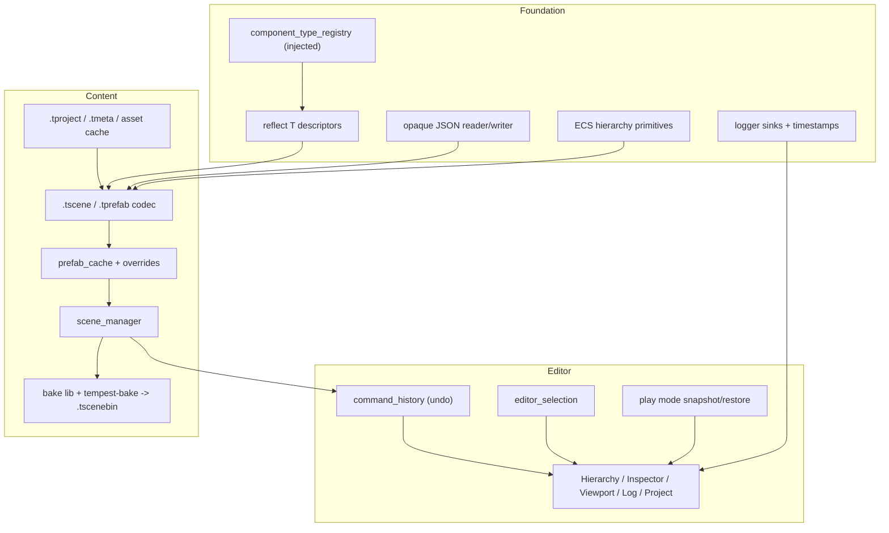

# Proposal: Editor & Scene System (Umbrella)

## Status
Proposed

## Context
The editor is mostly a static view of a world that game code builds procedurally. There is no way to:

- Save or load scenes.
- Author prefabs.
- Add, remove or undo changes to components.
- Roll back play mode.
- Bake content for the runtime.

The problem has two parts:

1. **Scene saves:** a human-readable scene and prefab format, multi-scene runtime loading, and a versioned binary bake.
2. **The editor:** creating, editing and destroying entities, managing project assets, play mode with reset, and new Log and Project panes.

This umbrella document records the foundation shared by both parts, the cross-cutting decisions, and the roadmap. Each subsystem is specified in a child proposal.

| Child proposal | Scope |
| :--- | :--- |
| [Component Reflection & Injected Type Registry](component_reflection_type_registry.md) | `component_type_registry` (dependency-injected, no statics), `reflect<T>` field descriptors, normalized type names, the cross-toolchain type-name gate, migrations |
| [Scene & Prefab Format, Prefab Instancing, Baking](scene_prefab_format_and_bake.md) | Opaque JSON writer, `.tscene` / `.tprefab` schema, local ids, prefab overrides and nesting, validation, `.tscenebin`, `tempest-bake` |
| [Scene Manager & Multi-Scene Loading](scene_manager_multi_scene_loading.md) | One world registry with many scenes, additive and single loading, the three-stage sync/async pipeline |
| [Project & Asset Workspace](project_asset_workspace.md) | `.tproject`, `.tmeta`, cache-only `.tassetdb`, built-ins, `.tmaterial`, `file_watcher`, reverse dependency index, removal flow |
| [Editor Authoring, Undo & Play Mode](editor_authoring_and_play_mode.md) | ECS hierarchy primitives, commands and undo, selection, hierarchy and inspector panes, snapshot/restore play mode, `game_module` contract, network play |
| [Editor Log View & Project View](editor_log_and_project_views.md) | Logger extensions, stateful Log View, single-column Project View |

---

## Proposed Architecture

## Key Decisions

| Area | Decision |
| :--- | :--- |
| Type identity | Normalized compiler type names (`core::get_type_name<T>()`), normalized so MSVC and Clang produce the same string. Literal-name shape tests plus golden manifest tests run on all three toolchains as the gate. An alias table handles renames. |
| Type registry | Instance-owned, injected into `archetype_registry` by its constructor. The static `get_archetype_type_index` map and the header-level `static` caches are removed. |
| Entity identity | A random 64-bit `local_id` per file, stored in `scene_entity_component`. Prefab members are addressed by `id_path`. |
| Source format | Deterministic JSON through yyjson, with **no yyjson in public headers**. |
| Prefabs | Live-linked, with per-field overrides. Nested prefabs are in v1. glTF imports become read-only model prefabs. Templates live in `prefab_cache`, outside the world. |
| Multi-scene | One world registry. `scene_handle` membership. No cross-scene `entity_ref` in v1. |
| Loading | Decode → resolve → time-sliced commit, shared by sync and async loading. |
| Project | `.tproject` and committed `.tmeta` sidecars. `.tassetdb` is a derived cache under `.cache/`. |
| Bake | Raw archetype blocks. `format_version` and `schema_hash` must match exactly. One `.tscenebin` per scene, plus a stripped asset database. |
| Editor modes | Edit → Playing ↔ Paused. A registry snapshot on Play is restored on Stop. "Persist to Scene" carries chosen changes across Stop. Undo/redo in v1. |
| Network | Play-in-editor as a client: Offline, Connect, or Launch local server. |
| Deferred | Viewport picking and gizmos, multi-entity inspector editing, cross-scene references, remote inspection, regex log search, animation authoring and state machines. |

## Pre-existing Defects Fixed by This Work
1. **Static type map.** `detail::get_archetype_type_index` uses a function-local static map, which is global mutable state forbidden by AGENTS.md. Fixed in M1 by injection.
2. **Type-name divergence.** MSVC `__FUNCSIG__` keeps elaborated keywords inside template arguments, so templated component names are expected to differ between toolchains. Fixed in M1 by normalization and pinned by shape tests.
3. **Default logger.** `make_default_logger` keeps only the last sink. Fixed in M1.
4. **`destroy()`.** It leaves dangling sibling and child links and name entries. Fixed in M1.
5. **Sibling order.** `create_parent_child_relationship` prepends, which reverses sibling order. Fixed in M1.
6. **`on_load` signature.** The game DLL's `on_load` is declared differently by the editor (`engine_context*`) and by the runner and the game (`client_context*`). Fixed in M7 by `game_module.hpp`.

## Risks
- **256 component types.** The archetype bitmask width caps the number of types. Registration reports overflow with a hard error. Widening the mask is a follow-up.
- **Renames break files.** Because files key on C++ names, renaming or moving a type to another namespace breaks them unless an alias is added. The golden manifest test turns that into a CI failure with instructions.
- **Snapshot cost.** Snapshot time is proportional to the world's size. The target is under 50 ms for 100k entities, measured in M7. Copy-on-write archetype chunks are the fallback if it's slower.
- **Game state outside the ECS** that `on_play_end` doesn't reset will leak across Stop. This is a documented game-side responsibility.

## Testing Strategy & Verification Matrix

New non-GPU test targets: `scene-tests`, `bake-tests`, `game-tests`. Each milestone gate requires:

1. **Three-toolchain build and test.** Ninja+Clang, MSVC v143 and MSVC v145, with zero warnings, run on every affected test target.
2. **TSan** (`--use-tsan`) for milestones that touch the job system, queues or threads: M1 logger, M2 log store, M3 file_watcher, M4 main-thread executor and async loading.
3. **Parent-agent audit** of subagent diffs, per AGENTS.md §3.
4. **The manual cases** listed in each child proposal.

| Invariant | Enforced by |
| :--- | :--- |
| Identical type names across toolchains | `core-tests` shape tests and golden manifests, run on all three toolchains |
| No static or global state in type resolution | `ecs-tests` with separate and shared type registries, plus a grep audit |
| Save → load → save is byte-identical; registry equal after round-trip | `scene-tests` |
| Bake load equals JSON load | `bake-tests` |
| Play → Stop restores handles and data exactly | `ecs-tests` snapshot tests, `editor-core-tests` |
| No yyjson in public headers | `core-tests` CI grep step |
| Hierarchy pane idle cost | `editor-core-tests` incremental-equals-rebuild test, plus a manual profiler check at 20k entities |

## Implementation Phases

Execute one milestone per turn, and stop for review after each one (AGENTS.md §2).

| Phase | Subsystem | Description | Child |
| :--- | :--- | :--- | :--- |
| **M1** | core / ecs / logger | Foundations: name normalization and shape tests; injected `component_type_registry`; `reflect<T>` and golden manifest; opaque `json_writer`; hierarchy primitives and `destroy` fix; logger `add_sink`, timestamps and default-logger fix | Reflection, Format, Authoring, Panes |
| **M2** | editor | Log View: `editor_log_sink`, `log_store`, stateful view, status pill | Panes |
| **M3** | assets / core | Project and assets: `.tproject`, `.tmeta`, cache-only database, built-ins, `.tmaterial`, `file_watcher` | Workspace |
| **M4** | scene / job | Scenes: `scene_manager`, `.tscene` load/save/validate, local ids, main-thread executor, async pipeline | Format, Manager |
| **M5** | scene / assets | Prefabs: `prefab_cache`, `.tprefab`, overrides, nesting, model prefabs, removal of `prefab_tag`, Save as Prefab | Format |
| **M6** | editor | Editing: `command_history` and undo, `editor_selection`, hierarchy cache and pane, reflected inspector | Authoring |
| **M7** | ecs / engine / game | Play mode: `registry_snapshot`, three-state machine, Persist to Scene, `game_module` contract, `main.tscene` migration, network play | Authoring |
| **M8** | editor | Project View, reverse dependency index, asset removal flow, drag-to-instantiate | Panes, Workspace |
| **M9** | bake / runner | Bake: `bake` library, `tempest-bake`, `.tscenebin`, baked asset database, runner startup-scene loading | Format |
