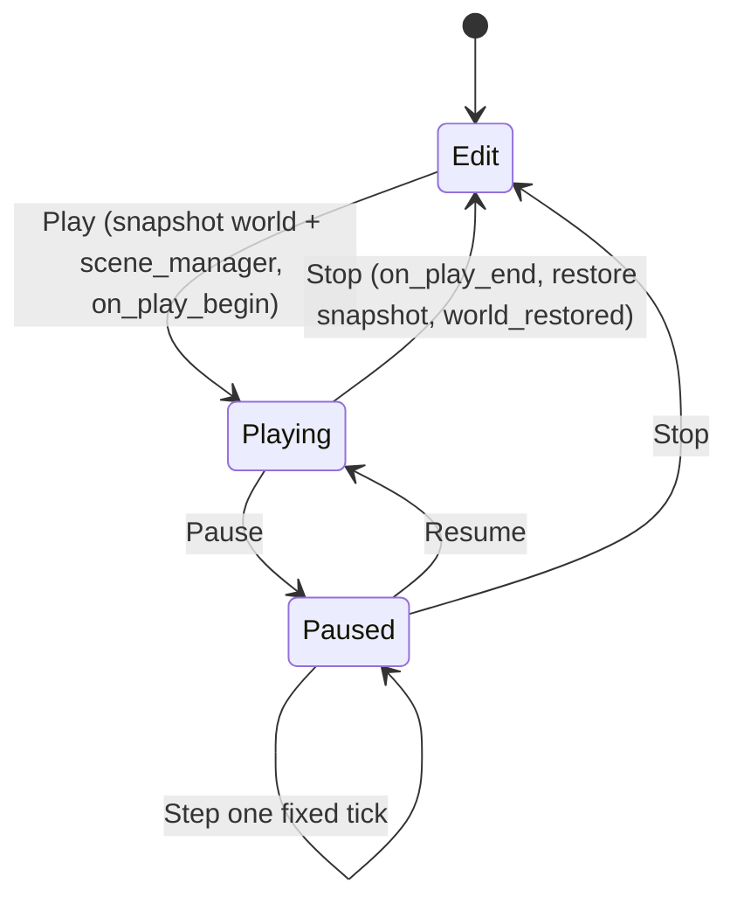

# Proposal: Editor Authoring, Undo, and Play Mode

## Status
Proposed. Child of [Editor & Scene System](editor_and_scene_system.md), Milestones M1 (ECS hierarchy primitives), M6 (authoring) and M7 (play mode).

## Context
The editor is mostly a static view today:

- **Selection.** One public `ecs::entity selected_entity` field on `scene_hierarchy_window`.
- **Inspector.** Draws hand-written `component_view_provider`s and has no way to remove a component.
- **Mutation.** Panes call `registry->replace(...)` directly, and there is no undo.
- **Play / Stop.** These only toggle `simulation_state { stopped, pause, play }`. Nothing is snapshotted or restored.
- **Game content.** The game DLL builds its world procedurally inside an initialize callback.
- **Signature mismatch.** The editor declares the game `on_load` as taking `engine_context*`, while the runner and the game use `client_context*`.
- **ECS hierarchy gaps:**
  - `create_parent_child_relationship` prepends children, so siblings end up in reverse insertion order.
  - There is no unlink or reparent operation.
  - `destroy()` leaves sibling links, children and name entries dangling.

Requirements covered: Editor 1–5, Viewport 1a–e, Entity Hierarchy 2a–c, Entity View 3a–c.

---

## Proposed Architecture



## Detailed Design

### 1. ECS Hierarchy Primitives (M1)
These are added to `basic_archetype_registry`:

```cpp
auto reparent(entity_type child, entity_type new_parent, entity_type insert_before = tombstone) -> void; // append by default
auto unlink(entity_type child) -> void;
auto destroy_recursive(entity_type root) -> void;
auto destroy_and_reparent_children(entity_type target) -> void; // children move to target's parent, keeping their position among siblings
```

- `destroy()` is fixed to unlink the entity from its parent and siblings, orphan its children to `tombstone`, and erase its `_names` entry.
- `create_parent_child_relationship` is reimplemented on top of `reparent`, so it appends.
- A new `entity_renamed_event` is published by `name(e, sv)`. The hierarchy cache depends on it.
- **World-preserving reparent** is an editor helper, not part of the ECS: `local = inverse(world(new_parent)) * world(child)`, decomposed back to translation, rotation and scale. Non-uniform scale under a rotated parent cannot be decomposed exactly. The helper is best-effort and logs a warning when shear would be lost. Holding Alt while dropping keeps the local transform instead.

### 2. Command Layer & Undo (M6)

```cpp
namespace tempest::editor
{
    struct entity_address
    {
        scene::scene_handle scene;
        inplace_vector<uint64_t, max_prefab_depth> id_path; // local ids; dynamic entities use a session id
    };

    class editor_command
    {
      public:
        virtual ~editor_command() = default;
        virtual auto apply(command_context& ctx) -> void = 0;
        virtual auto revert(command_context& ctx) -> void = 0;
        [[nodiscard]] virtual auto label() const -> string_view = 0;
        [[nodiscard]] virtual auto merge_with(const editor_command& next) -> bool; // coalesces drags
    };

    class command_history
    {
      public:
        auto execute(unique_ptr<editor_command> command) -> void;
        auto undo() -> void;
        auto redo() -> void;
        auto mark_saved() -> void;
        [[nodiscard]] auto is_dirty() const noexcept -> bool;
    };
}
```

- **Built-in commands:**
  - create entity (empty or from prefab)
  - destroy (recursive, or reparenting the children)
  - rename
  - reparent
  - add component, remove component, set field
  - revert override, apply override to prefab, unpack prefab
  - persist to scene
- **Stored values.** Commands store reflected values (type id plus bytes), keyed by `entity_address`, never by a raw `ecs::entity`. An undo after a play-mode restore therefore still finds its target.
- **Undo stacks:**
  - Edit mode keeps one stack per scene; Ctrl+Z acts on the active authoring scene.
  - Each play session keeps its own stack, which is discarded on Stop.
  - Unloading a scene clears its stack.
- **Dirty state.** A scene is dirty when its history position differs from the saved marker. Changes to the dirty flag are mirrored to `scene_record`.
- **Drag coalescing.** Continuous edits such as dragging a float merge into a single command through `merge_with` while the ImGui item stays active.
- **Single mutation path.** All panes mutate only through `command_history::execute`. The direct `registry->replace` calls in `engine_component_view_providers.cpp` are removed.

### 3. Selection (M6)
- `editor_selection` is a service owned by `editor_context`.
- It holds an ordered list of `entity_address` plus a cached live handle per entry, and tracks the primary entry.
- It resolves its handles again on `world_restored`, on undo and redo, and on scene unload.
- Multi-select uses Ctrl/Shift in the hierarchy. The bulk actions are delete, reparent (drag-drop) and Save as Prefab.
- The inspector edits only the primary entry.
- **Deferred:** viewport picking, gizmos, and multi-entity inspector editing.

### 4. Entity Hierarchy Pane (M6)
- **Cached model.** The pane keeps a `hierarchy_cache`: per-scene trees flattened into a row list over the *expanded* nodes. It is rebuilt incrementally from ECS events (entity created/destroyed, relationship component replaced, renamed), so a frame with no changes does zero tree walks.
- **Virtualization.** Rows are virtualized with `ImGuiListClipper`. That keeps the cost at about the visible row count even with tens of thousands of entities.
- **Row decorations:**
  - **Dynamic** (Hierarchy 2a): an entity with no `scene_entity_component`, or one created during the play session, shows a lightning icon and italic text.
  - **Networked:** shows a network icon.
  - **Prefab instance:** blue text, with Open / Select Prefab actions.
  - **Dirty:** the scene header row shows `*`.
- **Context menu:**
  - Create Empty and Create Empty Child.
  - Create from Prefab, which opens a picker filtered to prefab guids.
  - Rename, Duplicate.
  - Delete (with children), and Delete (keep children).
  - Save as Prefab.
  - Persist to Scene (play session only).
- Dragging rows reparents entities. Dragging prefabs or models in from the Project View instantiates them.

### 5. Entity View / Inspector (M6)
- **Generic inspector.** Drawing is driven by reflection: one widget per `field_kind`, with UI hints, units, and read-only or hidden flags. A hand-written `component_view_provider` still takes over for a type when one is registered.
- **Component management:**
  - Add Component lists every reflected, serializable, non-editor-only type that the entity doesn't already have.
  - Each component card has a ⋮ menu with Remove, Reset to Default, Copy/Paste Values and, on prefab instances, Revert Override and Apply to Prefab.
- **Markers:**
  - Components added during the play session, and every component on a dynamic entity, show the dynamic marker (Entity View 3a).
  - Overridden prefab fields have a bold label and a blue bar in the margin.
  - Unknown (opaque) components appear as red cards with Remove and Map to Type… actions.
- **Dynamic detection.** The editor keeps a `play_session_diff`, fed by `entity_created` and `component_added` / `component_removed` events while a session is running. No tag component is added to runtime entities.

### 6. Play Mode (M7)

#### Modes
- **Edit** is the initial state when the editor opens; it corresponds to the requirements' "paused".
- Then **Playing**, and **Paused** (paused during a session).
- `simulation_state` is renamed to these three values.
- **Edit mode systems.** Rendering, transform history and editor-camera update run in Edit mode. The fixed and variable callbacks registered by the game, plus physics, run only while Playing; Paused allows single-stepping one fixed tick.

#### Snapshot & restore
```cpp
class registry_snapshot; // opaque: archetype storage copies, entity store (versions + free list), name table

[[nodiscard]] auto basic_archetype_registry::snapshot() const -> registry_snapshot;
auto basic_archetype_registry::restore(registry_snapshot&& snapshot) -> void;
```

- `restore` puts back every entity handle exactly as it was, versions included.
- It suppresses per-entity events and publishes a single `world_restored_event` instead.
- `scene_manager` and `prefab_cache` membership state are captured alongside it.

**Play sequence:**
1. Snapshot the world and the scene manager.
2. Publish `simulation_started_event`.
3. Call `game_module::on_play_begin`.
4. Switch the render camera from the editor camera to the active `camera_component` (Viewport 1b).

**Stop sequence:**
1. Call `game_module::on_play_end`.
2. Restore the snapshot.
3. Publish `world_restored_event`. Physics (Jolt bodies), renderer caches and the hierarchy cache rebuild from components.
4. Switch back to the editor camera, at the position it had before Play.

**Game state outside the ECS** must be reset in `on_play_end`. A play session that leaks state across Stop is treated as a game bug, and that rule is documented in the game-module contract.

#### Persist to Scene (Entity View 3c, Hierarchy 2b)
- During a session, this action copies the live reflected values of the selected entity, or a single component, into the snapshot. It can only target entities that came from a scene, or dynamic entities.
- A dynamic entity gets a new `local_id` and joins the active authoring scene.
- The scene is marked dirty. On Stop the change survives the restore, and the user must still save explicitly. Saving to disk is disabled during a session.

#### Network play (Viewport 1e)
- A Play settings dropdown offers **Offline**, **Connect to host:port** and **Launch local server + connect**.
- The last option spawns `tempest-server` as a child process and kills it on Stop.
- The game module's client path (today's `--connect`) is given the endpoint through `on_play_begin(play_settings)`.
- Replicated entities show the networked marker. The world restore on Stop also discards replicated entities.

### 7. Game Module Contract (M7)

```cpp
// exported from game-runtime.dll
extern "C" TEMPEST_GAME_API auto tempest_game_register_types(ecs::component_type_registry& types) -> void;
extern "C" TEMPEST_GAME_API auto tempest_game_on_load(engine_context& ctx, span<const string_view> args) -> void; // systems only
extern "C" TEMPEST_GAME_API auto tempest_game_on_unload() -> void;
extern "C" TEMPEST_GAME_API auto tempest_game_on_play_begin(const play_settings& settings) -> void; // editor only
extern "C" TEMPEST_GAME_API auto tempest_game_on_play_end() -> void;                                // editor only
```

- One header, `tempest/game_module.hpp`, declares these entry points. The runner, the editor entrypoint and `tempest-bake` all include it, which fixes the signature mismatch.
- **`register_types`** is called before any scene is loaded, in all three hosts.
- **`on_load`** registers callbacks but never spawns world content. In the runner, the game executable loads the startup scene.
- **Migrating the procedural world.** Today's setup (Camera, Sun, FloorPlane, StepObstacle, CapsuleProxyTarget) becomes `game/assets/scenes/main.tscene`. It uses built-in primitives, and `.tmaterial` assets for the five procedural materials.

### 8. Editor Session
`.cache/editor_session.json` restores the open scenes, the active authoring scene, the editor camera pose, the dock layout (ImGui ini contents) and the Play settings.

## Public API Surface & Subsystem Invariants
- **Mutation path.** Every editor mutation goes through `command_history`. Panes never call registry mutators directly.
- **Handle stability.** Handles are bit-identical across Play → Stop. Editor-side state keyed by `entity_address` survives any handle change.
- **External state.** Subsystems that hold state outside the ECS must handle `world_restored_event`.
- **Library lifetime.** Snapshots are destroyed before dynamic libraries unload (concurrency_runtime.md §2).

## Verification Plan

**`ecs-tests`**
- `reparent` appends, honours `insert_before`, and rejects cycles.
- `unlink`.
- `destroy` fixes up siblings and children and erases the name.
- `destroy_recursive`, and `destroy_and_reparent_children` preserving sibling position.
- `entity_renamed_event` is published.
- `snapshot` / `restore` round-trip: create, destroy, add and remove components after the snapshot, then restore. Check handle equality, version equality, free-list behaviour (the next `create()` matches the pre-play sequence), component bytes, names, and a single `world_restored_event`.

**`editor-core-tests` (non-GPU)**
- Each command's apply → revert → apply is idempotent (compared by reflection).
- Drag merging.
- Dirty tracking against the saved marker.
- Undo after restore resolves by `entity_address`.
- `hierarchy_cache` incremental updates match a full rebuild after 10k random operations.
- `play_session_diff` classification.
- Persist to Scene survives restore.
- Selection re-resolution.

**`tempest-tests`**
- World-preserving reparent stays within tolerance for uniform scale.
- Shear warning path.

**Manual**
1. The editor opens in Edit mode with the editor camera.
2. Press Play. The view switches to the game camera and the simulation runs. Spawned entities show the dynamic marker.
3. Pause, then step.
4. Stop. Every spawned entity disappears, every value is back to its pre-Play state, and the editor camera returns to its earlier pose.
5. Persist a moved entity during Play, then Stop. The change remains and the scene is dirty.
6. Undo and redo across each command type.
7. Play with Launch local server + connect. The server process starts, replicated entities are marked, and Stop kills the server.
8. With 20k entities, the hierarchy pane frame time stays under 1 ms with no changes (Tracy / profiler zone).

## Implementation Phases
| Phase | Subsystem | Description |
| :--- | :--- | :--- |
| M1 | ecs | Hierarchy primitives, `destroy` fixes, `entity_renamed_event` |
| M6.1 | editor | `command_history`, built-in commands, `editor_selection` |
| M6.2 | editor | `hierarchy_cache` and pane rewrite, context menus, drag-drop |
| M6.3 | editor | Generic reflected inspector, component management, prefab override UI |
| M7.1 | ecs / engine | `registry_snapshot`, `world_restored_event`, three-state machine, camera switching |
| M7.2 | game / engine | `game_module` contract, `main.tscene` migration, split between edit and simulation systems |
| M7.3 | editor | Persist to Scene, `play_session_diff` markers, network play settings, editor session |
