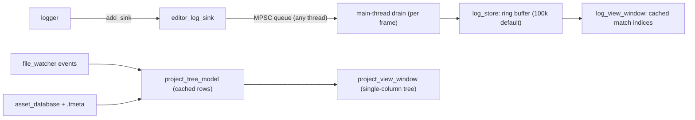

# Proposal: Editor Log View & Project View

## Status
Proposed. Child of [Editor & Scene System](editor_and_scene_system.md), Milestones M1 (logger), M2 (Log View) and M8 (Project View).

## Context
**Logger.**
- The engine logger (`engine/runtime/logger`) fixes its `vector<log_sink*>` at construction.
- Records carry only the level, the message and a `source_location`: no timestamp, no thread id.
- `standalone_engine_context::make_default_logger` overwrites the logger once per sink, so only the last sink survives (`tempest.cpp:23-38`).
- Logs come from job workers as well as the main thread.

**Panes.** There is no log pane and no asset browser.

Requirements covered: Log View 4a–e, Project View 5a–d, Editor 6.

---

## Proposed Architecture



## Detailed Design

### 1. Logger Extensions (M1)

```cpp
namespace tempest
{
    struct log_record
    {
        log_level level;
        uint64_t timestamp_ns;  // steady clock since engine start
        uint32_t thread_id;
        string_view message;    // valid only for the duration of do_log
        source_location source;
    };

    class log_sink
    {
      public:
        virtual auto do_log(const log_record& record) -> void = 0;
        // min/max level filtering is unchanged
    };

    class logger
    {
      public:
        auto add_sink(log_sink& sink) -> void;
        auto remove_sink(log_sink& sink) -> void;
        [[nodiscard]] auto wall_clock_base() const noexcept -> int64_t; // UTC ns at engine start
    };
}
```

- The sink list is protected by a lightweight reader/writer lock, because logging happens on many threads and adding or removing sinks is rare.
- The existing stdout sinks are updated to take the new signature.
- The `make_default_logger` bug is fixed: one logger is created with every default sink.

### 2. Log Store & Ingest (M2)
- **Capture.** `editor_log_sink::do_log` copies the message into a chunked string arena and pushes `{level, timestamp, thread, arena span, file, line}` onto an `mpsc` queue. It never touches UI state.
- **Drain.** `log_store::drain()` runs once per frame on the main thread and appends records to a ring buffer. Capacity comes from `.tproject` → `editor.log_capacity`, default 100,000. When the buffer is full, the oldest records are dropped and recycled, and a `dropped_count` is incremented.
- **Sequence numbers.** Every record gets a monotonically increasing `sequence` number. View state refers to records by sequence number, never by position in the ring, so eviction can never leave a dangling index.

### 3. Log View (M2)
- **Clear** (4b) sets `visible_from_sequence = next_sequence`. Nothing is freed, and only records ingested afterwards are shown.
- **Filters** (4c):
  - Level toggles, with a count per level shown on each toggle.
  - A time range, either relative ("last N s/min") or absolute from/to, in local wall-clock time computed from `wall_clock_base + timestamp_ns`.
- **Search** (4d): case-insensitive substring match on the message. Regex search is deferred.
- **Stateful view** (4e):
  - The window keeps a `vector<uint64_t> matches` of matching sequence numbers.
  - It is rebuilt from scratch only when the filter, search or clear state changes.
  - Newly drained records are tested once against the current filter and appended.
  - Records evicted from the ring are trimmed from the front of `matches`.
  - A relative time filter only re-evaluates once per second, and only trims from the front.
- **Rendering.**
  - Rows are drawn with `ImGuiListClipper` and show time, level badge, thread, message and `file:line`.
  - An auto-scroll toggle sticks to the bottom only while the user is already at the bottom.
  - Double-clicking a row copies it; right-click offers Copy, Copy All Filtered and Open Source Location.
- **Status bar.** The editor status bar shows a pill with the error and warning counts since the last clear. Clicking it focuses the Log View.

### 4. Project View (M8)
- **Single-column tree** (Unity "One Column Layout") rooted at the project's mount roots (5a).
  - Folders and files are interleaved: folders first, then files alphabetically.
  - Moving up and down the tree is done by expanding and collapsing nodes (5b). There is a search filter box, plus a Reveal in Explorer action.
- **Imported vs loose** (5d):
  - **Imported files** (with a `.tmeta`) show a type icon and can be expanded to list their sub-assets: prefab, meshes, materials, textures.
  - **Loose files** are greyed out with an Import action (5c). It is enabled only when an importer is registered for the file extension.
  - `.tmeta` files themselves are hidden.
- **Cached model.**
  - `project_tree_model` holds a node tree plus the flattened list of expanded rows.
  - Only `file_watcher` events and import or removal results invalidate it, and only the affected directory nodes.
  - Rows are virtualized with `ImGuiListClipper`.
- **Drag sources:**
  - A prefab or model dropped onto the hierarchy instantiates under the drop target.
  - Dropped onto the viewport, it instantiates at the camera-ray hit point; if nothing is hit, 5 m in front of the camera.
  - A material dropped onto an entity in the hierarchy assigns `material_component`.
  - Each of these is an undoable `editor_command`.
- **Context menu:** Import, Reimport, Remove from Project (runs the removal flow in [Project & Asset Workspace](project_asset_workspace.md)), Create > Folder / Material / Scene, Open Scene (Single / Additive), Rename.

## Public API Surface & Subsystem Invariants
- **Thread confinement.** Sinks never touch UI state. All view state is owned by the main thread.
- **Zero allocation per frame when idle.** A frame with no new logs and no input does no filtering work.
- **Shutdown order.** `editor_log_sink` is removed from the logger before it is destroyed. RAII registration handles guarantee this.

## Verification Plan

**`logger` tests (in `core-tests` or a new `logger-tests` target)**
- `add_sink` / `remove_sink` while other threads are logging.
- Timestamps are monotonic per thread.
- The default logger delivers to every sink (regression test for the last-sink bug).

**`editor-core-tests`**
- `log_store`: ring eviction and dropped count; sequence numbers stay stable across eviction.
- Clear hides earlier records and shows later ones.
- The incremental filter result equals a full rebuild after a random mix of ingest, filter and clear operations.
- Search is case-insensitive.
- Relative time window trimming.
- `project_tree_model`: classification of imported and loose files; sub-asset expansion; incremental invalidation touches only the affected directories; `.tmeta` files are hidden.

**TSan**
- Logger tests and `editor-core-tests` log-store tests: multiple producer threads, one main-thread drain.

**Manual**
- Flood 1M log lines from workers. The editor stays responsive and the drop counter increases.
- Filter by Error, search, then clear. Only new entries appear.
- Import a loose `.glb`, drag it into the viewport, and undo.

## Implementation Phases
| Phase | Subsystem | Description |
| :--- | :--- | :--- |
| M1 | logger | `log_record`, `add_sink` / `remove_sink`, timestamps and thread ids, default-logger fix |
| M2 | editor | `editor_log_sink`, `log_store`, `log_view_window`, status-bar pill |
| M8 | editor | `project_tree_model`, `project_view_window`, drag-to-instantiate, context actions |
