# Proposal: Networked Physics, Client Prediction & Procedural World Generation

## Status
Proposed

## Context
Tempest has established a modern Vulkan rendering backend (bindless PBR, CSM shadows, GPU timestamps, and render graph synchronization). To transition into an interactive, multiplayer-capable engine, the next foundational subsystems must be established:
1. **Physics**: Rigid bodies, collision detection, and character control via Jolt.
2. **Networking**: Server-authoritative state replication, client-side input prediction, and remote entity interpolation/dead reckoning.
3. **World Generation**: Large-scale macro terrain generation (10km+ features: biomes, tectonics, mountain ranges) and local micro terrain generation (hills, erosion, high-resolution visual and collision detail).

Attempting to implement these three domains in isolation creates severe architectural friction:
- Building networking without physics forces throwaway kinematic replication code.
- Building world generation without physics leaves the world unnavigable and uncollidable.
- Generating client-side micro-terrain that differs from server-side collision causes catastrophic prediction desyncs (severe rubber-banding).

This document proposes a unified, interleaved architectural roadmap divided into four **Macro Milestones**, each decomposed into concrete **Micro Milestones** structured as end-to-end vertical slices.

---

## Architectural Principles

```mermaid
flowchart TD
    subgraph Shared Generation Logic ["Shared Deterministic Generator (engine/runtime/terrain)"]
        Seed["World Seed + Macro Tectonic Context"]
        Gen["Pure Deterministic Noise & Height Functions\nStrict IEEE-754 / Integer Hashing"]
        Seed --> Gen
    end

    subgraph Server Architecture ["Headless Server Process"]
        Gen --> S_Col["Micro Jolt HeightFieldShape (Collision Only)"]
        S_Col --> S_Phys["Server Jolt Physics World\n(Authoritative 60Hz Simulation)"]
        Net_S["Server Network Transport\n(Input Queue & Snapshot Broadcaster)"] <--> S_Phys
    end

    subgraph Client Architecture ["Client Process (Vulkan + Audio + Input)"]
        Gen --> C_Col["Micro Jolt HeightFieldShape (Collision)"]
        Gen --> C_Vis["High-Poly Meshes, Normals & Material Splatting (Vulkan)"]
        C_Col --> C_Phys["Client Jolt Physics World\n(Local Prediction & Replay)"]
        Input["Local Input Buffer"] --> C_Phys
        Input --> Net_C["Client Network Transport\n(Input Streamer & Reconciler)"]
        Net_C <--> Net_S
        Net_C -->|State Correction / Rollback| C_Phys
        C_Phys -->|Transform Interpolation (Alpha)| Render["Renderer / Scene Graph"]
        C_Vis --> Render
    end
```

### 1. The Shared Deterministic World Generator
- **Zero Geometry Bandwidth**: Rather than streaming gigabytes of terrain vertex meshes or dense height grids over the network, both server and client execute the **identical deterministic terrain generator** from a shared seed and chunk coordinate:
  $$h(x, z) = \text{EvaluateHeight}(x, z, \text{Seed})$$
- **2.5D Heightfield Grids with Analytical Erosion**:
  - Terrain is represented as 2.5D heightfield grids, mapping directly to `Jolt::HeightFieldShape`.
  - Micro-erosion uses analytical, $O(1)$ procedural approximations (slope-biased ridge noise, thermal talus slopes, and hydraulic valley carving) evaluated statelessly without iterative particle simulation or boundary seams.
  - Base terrain is static and procedural; interactive trees, rocks, props, and structures are placed dynamic/static ECS entities.
- **Decoupled Collision vs. Visuals**:
  - The **client** generates dense Vulkan geometry, normal maps, foliage scattering, and a Jolt `HeightFieldShape`.
  - The **headless server** generates *only* the Jolt `HeightFieldShape` (skipping normals, UVs, and visual buffers), achieving $\approx 85\%$ lower memory and CPU overhead.
- **Collision Parity**: Because both client and server evaluate the exact same math with strict IEEE-754 precision (`-fno-fast-math`), the ground height matches to sub-millimeter precision, allowing local client prediction on slopes without rubber-banding.

### 2. Time & Prediction Model
- **Fixed-Timestep Runner**: Physics simulation runs at a deterministic fixed rate of **60 Hz** ($\Delta t = 16.666\text{ms}$) with Jolt's deterministic simulation mode enabled. Variable-rate frame rendering interpolates between previous and current simulation transforms using the accumulator remainder $\alpha \in [0, 1)$.
- **Character Controller**: Implemented via `Jolt::CharacterVirtual`, providing snappy kinematic action controls, precise stair-stepping, slope sliding, and isolation from dynamic rigid-body solver jitter.
- **Local Player (Input Prediction & Resimulation)**: The client predicts movement immediately upon input and buffers inputs in an unacknowledged ring buffer. When the server snapshot arrives, if the predicted state diverged by $> \epsilon$, the client restores state to the server tick, replays buffered inputs forward through `CharacterVirtual::Update`, and applies an exponential visual error decay vector to mask the correction.
- **Remote Players (Dead Reckoning & Interpolation)**: Remote entities are extrapolated using velocity vectors with Hermite cubic spline smoothing.
- **Custom Tempest UDP Transport**: Direct WinSock2 / POSIX non-blocking UDP sockets utilizing `tempest::` primitives, custom packet bitstreams, and sequence ACKs.
- **Unified Fiber Scheduling**: Custom `TempestJoltJobSystem` binding Jolt's task dispatcher directly to Tempest's worker threads/fibers for zero thread contention and unified telemetry.

---

## Roadmap: Macro & Micro Milestones

```mermaid
gantt
    title Interleaved Subsystem Roadmap
    dateFormat  X
    axisFormat %d
    section Macro 1: Physics Core
    1.1 Fixed-Timestep Runner & State Interpolation :0, 2
    1.2 Jolt Integration & Allocator/Job Binding    :2, 5
    1.3 Character Controller (CharacterVirtual)     :5, 8
    1.4 State Snapshotting & Primitives             :8, 10
    section Macro 2: Networked Prediction
    2.1 Headless Server Target                      :10, 12
    2.2 Transport Protocol & Framing               :12, 15
    2.3 Input Ring Buffer & Client Prediction      :15, 18
    2.4 Server Authority & Reconciliation Replay    :18, 22
    section Macro 3: Procedural World Spike
    3.1 Deterministic Math & Generator Core         :22, 25
    3.2 Jolt Heightfield Shape Integration          :25, 28
    3.3 Client Terrain Mesh & Rendering             :28, 31
    3.4 Prediction on Procedural Slopes             :31, 34
    section Macro 4: Streaming & Multi-Client
    4.1 Server Interest Bubbles & LRU Chunks        :34, 38
    4.2 Client Async Streaming & Micro-LOD          :38, 42
    4.3 Remote Player Dead Reckoning                :42, 45
    4.4 Dynamic Modification Delta Layer            :45, 48
```



---

### Macro Milestone 1: Physics Core & Fixed-Timestep Simulation
**Objective**: Build a responsive local character controller navigating 3D collision primitives on a deterministic fixed-tick loop with render transform interpolation.

#### Micro Milestones:
- **Micro 1.1: Fixed-Timestep Runner & State Interpolation Loop**
  - Implement fixed accumulator loop ($\Delta t = 1/60\text{s}$) decoupled from variable rendering frame rate.
  - Implement render transform interpolation:
    $$T_{\text{render}} = \text{lerp}(T_{\text{prev}}, T_{\text{curr}}, \alpha), \quad \alpha = \frac{\Delta t_{\text{accum}}}{\Delta t_{\text{fixed}}}$$
  - Define `transform_history_component` to track tick states in ECS.
- **Micro 1.2: Jolt Physics Shim DLL & STL Isolation Boundary**
  - Encapsulate Jolt inside a dedicated dynamic library `tempest-jolt-shim.dll` statically linking `Jolt.lib` with `JPH_CROSS_PLATFORM_DETERMINISTIC`.
  - Expose a pure opaque-handle C ABI (`jolt_system_handle`, `jolt_character_handle`, `jolt_shape_handle`) to `engine/runtime/physics` with zero standard library headers or symbols.
  - Forward memory allocation callbacks to `tempest::memory::allocate` / `deallocate`.
  - Bind Jolt job scheduler to Tempest's worker threads / fiber job system via `jolt_job_dispatch_fn`.
  - Configure collision layers: `NonMoving` (Static), `Moving` (Dynamic), `Character`, `Debris`.
- **Micro 1.3: Character Controller (`Jolt::CharacterVirtual`)**
  - Implement `character_controller_component` wrapping `Jolt::CharacterVirtual`.
  - Handle capsule collision, slope angle limits ($45^\circ\text{–}60^\circ$), stair stepping, ground adhesion, and gravity.
  - Map WASD and jump inputs into character velocity vectors.
- **Micro 1.4: Physics State Snapshotting & Static Geometry Tests**
  - Provide serialization functions to extract and restore `character_controller_state` (position, linear velocity, ground state).
  - Construct test levels with planes, ramps, steps, and dynamic boxes.
  - Automated tests: Verify fixed-tick simulation repeatability, character step-climbing, and collision box raycasts.

---

### Macro Milestone 2: Loopback Client-Server & Input-Predicted Movement
**Objective**: Run two engine processes (dedicated headless server and client) communicating over local sockets with simulated latency, proving server authority and client prediction reconciliation.

#### Micro Milestones:
- **Micro 2.1: Headless Server Runner Target**
  - Add Premake configuration and executable entry point `tempest-server`.
  - Initialize Logger, Job System, ECS, and Physics without creating Vulkan instances, window handles, or swapchains.
- **Micro 2.2: Transport Protocol & Message Framing**
  - Implement UDP socket abstraction in `engine/runtime/network` supporting non-blocking I/O.
  - Implement packet framing: protocol version, sequence numbers, packet type flags, and payload bitstreams.
  - Add debug network simulator injecting artificial latency (e.g. 100ms), jitter (e.g. $\pm 20\text{ms}$), and packet loss (e.g. $5\%$).
- **Micro 2.3: Input Ring Buffer & Client Prediction**
  - Client serializes `user_cmd`: `(tick_id, move_vector, look_yaw, buttons)`.
  - Client predicts physics immediately on input, storing `(tick_id, user_cmd, predicted_state)` in a fixed 128-entry circular buffer.
  - Client streams `user_cmd` stream to server.
- **Micro 2.4: Server Authority, Reconciliation & Visual Smoothing**
  - Server validates client inputs against authoritative Jolt world and broadcasts `server_state`: `(server_tick, last_processed_client_tick, position, velocity, ground_state)`.
  - Client reconciliation: Compare predicted position for `last_processed_client_tick` against server state:
    $$\Delta = ||\mathbf{p}_{\text{pred}} - \mathbf{p}_{\text{auth}}||$$
    - If $\Delta > \epsilon$ (e.g. $2\text{cm}$): Restore state to $\mathbf{p}_{\text{auth}}$, discard older inputs, and resimulate Jolt forward to current tick using remaining unacknowledged inputs.
    - Apply visual error decay vector $\mathbf{e}_{\text{vis}}$ that smoothly decays to zero over $100\text{ms}$ to prevent visual snapping.
  - Automated tests: Mock network client moves forward for 100 ticks under 150ms ping; assert zero rubber-banding after steady-state prediction.

---

### Macro Milestone 3: Procedural Deterministic World Generation (Base Spike)
**Objective**: Replace flat test ground with procedural heightfield terrain generated deterministically on both server and client, verifying prediction over uneven terrain.

#### Micro Milestones:
- **Micro 3.1: Pure Deterministic Noise & Generator Core**
  - Create `engine/runtime/terrain` runtime module.
  - Implement integer hash functions (PCG / xxHash) and deterministic Simplex/Perlin noise layers.
  - Enforce strict floating-point determinism (`/fp:precise`, `-fno-fast-math`).
  - Expose stateless evaluation: `float sample_height(double world_x, double world_z, uint64_t seed)`.
- **Micro 3.2: Jolt Heightfield Shape Integration (Shared Server & Client)**
  - Implement chunk grid generator producing samples for an $N \times N$ cell chunk (e.g. $64\text{m} \times 64\text{m}$ at 1m resolution).
  - Construct `Jolt::HeightFieldShape` and register it in the Jolt physics world.
  - Both server and client execute this identical step for the active chunk.
- **Micro 3.3: Client Terrain Mesh Generation & Bindless Rendering**
  - Client worker jobs compute vertex normals, tangents, and index buffers for the chunk.
  - Allocate GPU geometry buffers using Slang BDA (Buffer Device Address).
  - Render terrain chunks via existing PBR pipeline with slope-based triplanar material blending (grass, rock, dirt).
- **Micro 3.4: Prediction on Procedural Slopes & Irregular Ground**
  - Drive character controller across procedural hills, valleys, and ridges over network simulation.
  - Tune ground projection, slope sliding threshold, and reconciliation tolerance $\epsilon$ on rough surfaces.
  - Automated tests: Height query parity test verifying 50,000 random coordinates yield identical heights on both client and server.

---

### Macro Milestone 4: Macro Streaming, Micro Detail & Multi-Client Synchronization
**Objective**: Expand to a 10km+ world with dynamic chunk streaming, worker-thread micro-generation, server spatial caching, and multi-player Dead Reckoning.

#### Micro Milestones:
- **Micro 4.1: Server Spatial Interest Management & LRU Chunk Cache**
  - Server maintains player "interest bubbles" (e.g., radius of 500m around active player entities).
  - Active chunks are reference-counted:
    - Entering a chunk activates generation jobs.
    - Exiting unreferences the chunk, moving it to an LRU queue with deferred Jolt shape unloading.
- **Micro 4.2: Client Asynchronous Chunk Streaming & Micro-LOD**
  - Implement concentric streaming rings around camera (LOD 0: fine mesh + collision; LOD 1–3: simplified meshes, no physics).
  - Generate micro-erosion and high-frequency displacement asynchronously on worker fibers without dropping frame rates.
- **Micro 4.3: Remote Player Replication & Dead Reckoning**
  - Server broadcasts positions and velocities of other players in the same interest sector.
  - Client instantiates remote proxy entities:
    - Extrapolate remote player positions between packets:
      $$\mathbf{p}(t) = \mathbf{p}_0 + \mathbf{v}_0 \Delta t + \frac{1}{2} \mathbf{a}_0 \Delta t^2$$
    - When new packet arrives, blend using Hermite cubic spline to eliminate positional pops.
- **Micro 4.4: Dynamic Terrain Modification Delta Layer**
  - Implement sparse delta storage (e.g. local voxel/height edits from explosions or digging).
  - Server replicates deltas; client applies deltas on top of deterministic base:
    $$\text{FinalChunk} = \text{BaseGenerator}(\text{Seed}) \oplus \text{Deltas}$$
  - Dynamic Jolt shape patching when deltas are applied.

---

## Verification & Quality Gates

Each milestone must pass automated and manual quality gates before advancing:

| Milestone | Automated Test Suite | Manual Verification Gate |
| :--- | :--- | :--- |
| **Macro 1** | `physics-tests` (Fixed-tick stability, character step tests, raycasts, allocator leak checks). | Character navigates ramps, stairs, and boxes with smooth 144Hz render interpolation. |
| **Macro 2** | `network-tests` (Packet bitstream serialization, input queue sequencing, prediction resimulation under loss). | Two instances on localhost with 120ms ping; local movement feels latency-free without visual rubber-banding. |
| **Macro 3** | `terrain-tests` (Cross-platform height parity verification, Jolt heightfield shape creation). | Player walks seamlessly across procedural hills and valleys with authoritative collision and no slope desync. |
| **Macro 4** | `streaming-tests` (Spatial hash interest tests, LRU cache eviction, delta serialization). | Two clients explore different areas of a 10km world; chunks stream smoothly without frame hitches; players see each other move smoothly. |
