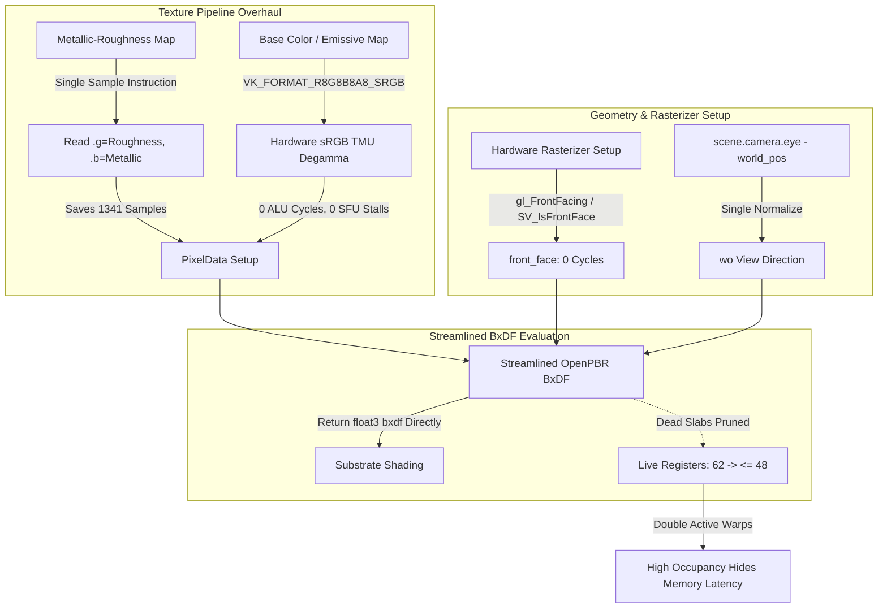

# Proposal: OpenPBR Codegen & Register Pressure Optimization

## Status
Proposed

## Context
In GPU execution profiles, [`pbr.slang`](file:///d:/Code/tempest/engine/runtime/render/system/shaders/raster/pbr.slang) fragment execution is severely constrained by **register pressure** and **redundant memory/ALU operations**:

- **Occupancy Choke**: `FSMain` utilizes **62 live registers** out of a 64-register limit per thread. This register pressure restricts the number of active warps that can reside concurrently on a GPU Streaming Multiprocessor (SM) / Workgroup Processor (WGP).
- **Extreme Warp Latency**: Average warp latency reaches **5,343 cycles**, with **46.9% of all stalls attributed to Long Scoreboard (`LGSB`)** memory dependencies. Because occupancy is low, the GPU cannot schedule alternative warps while one warp waits for texture data.
- **Redundant Sampling of Metallic-Roughness**: [`material.slang`](file:///d:/Code/tempest/engine/runtime/render/system/shaders/common/material.slang#L75) line 75 samples `metallic_roughness_map_id` for `.b` (**2,450 samples**), and line 107 samples the exact same descriptor at the exact same UV for `.g` (**1,341 samples**). This results in **3,791 samples** across two identical texture instructions.
- **Software sRGB Math**: [`colorspace.slang`](file:///d:/Code/tempest/engine/runtime/render/system/shaders/common/colorspace.slang#L25-L45) performs software degamma using piecewise `pow((input + 0.055) / 1.055, 2.4)` on each RGB component (**759+ samples**, heavy `Math Pipe Throttle`).
- **Dead Slab Storage in `BxDFResult`**: [`openpbr.slang`](file:///d:/Code/tempest/engine/runtime/render/system/shaders/common/bxdf/openpbr.slang#L200-L206) assigns 6 unused slab outputs (`result.diffuse`, `result.specular`, `result.subsurface`, `result.transmission`, `result.coat`, `result.fuzz`) into a 36-float struct, even though [`pbr_common.slang`](file:///d:/Code/tempest/engine/runtime/render/system/shaders/common/pbr_common.slang#L216) only reads `result.bxdf` (`substrate`).
- **Duplicate View Vector Normalization**: `view_dir` is computed in `pbr.slang` line 53 (**275 samples**), and the identical vector `wo` is computed again in `pbr_common.slang` line 191 (**293 samples**).
- **Production Debug Pointer Indirection**: In `pbr.slang` line 82, checking `shadow_data.debug_mode != 0` costs **459 samples** (174 `LGSB` stalls) across Physical Storage Buffer pointers even when visual debugging is disabled.

---

## Proposed Architecture



---

## Detailed Design

### 1. Merged Metallic-Roughness Texture Sampling

In standard glTF 2.0 assets, roughness is stored in the green channel and metallic in the blue channel of the same image. Merge the two fetches in [`material.slang`](file:///d:/Code/tempest/engine/runtime/render/system/shaders/common/material.slang):

```slang
// ELIMINATED: fetch_metallic() and fetch_roughness() issuing two separate .Sample() calls

[ForceInline]
void fetch_metallic_roughness(const MaterialState mat_state, float2 uv, out half metallic, out half roughness) {
    half4 mr_sample = half4(bindless_textures[(int)mat_state.mat.metallic_roughness_map_id]
                                .Sample(mat_state.linear_sampler, uv));
    roughness = half(mat_state.mat.roughness_factor) * mr_sample.g;
    metallic  = half(mat_state.mat.metallic_factor)  * mr_sample.b;
}
```
**Immediate Gain: Eliminates 1,341 texture samples and frees temporary texture coordinate registers.**

---

### 2. Hardware sRGB Texture Views

In Vulkan, hardware texture filtering units automatically perform sRGB to linear conversion in dedicated silicon during bilinear filtering when an image view is created with an `_SRGB` format.

In the texture asset importer ([`gltf_importer.cpp`](file:///d:/Code/tempest/engine/runtime/assets/src/importers/gltf_importer.cpp)) and image creation:
- Create Base Color and Emissive texture views with `rhi::data_format::rgba8_srgb` (or `bc7_srgb`).
- In [`material.slang`](file:///d:/Code/tempest/engine/runtime/render/system/shaders/common/material.slang), delete software degamma calls:
  ```slang
  // ELIMINATED:
  // texture_color.rgb = iec_srgb_to_linear(texture_color.rgb); // 759 samples in pow() math
  ```
**Immediate Gain: Eliminates 759+ samples, removes transcendental SFU math pipe throttling, and cuts 4 live registers.**

---

### 3. Hardware Front-Facing & Vector Reuse

1. **Hardware Front-Facing**: Replace software dot-product normal testing with the hardware rasterizer's triangle winding flag:
   ```slang
   // In VertexOutput / PixelInput:
   bool is_front_face : SV_IsFrontFace;
   ```
2. **Single View Direction Normalization**: In `FSMain` of [`pbr.slang`](file:///d:/Code/tempest/engine/runtime/render/system/shaders/raster/pbr.slang), compute `wo` once and pass it down:
   ```slang
   float3 wo = normalize(scene.camera.eye.xyz - input.world_position);
   ```
   Pass `wo` directly into `evaluate_material_openpbr()`, eliminating the duplicate normalization in [`pbr_common.slang`](file:///d:/Code/tempest/engine/runtime/render/system/shaders/common/pbr_common.slang#L191) line 191.
**Immediate Gain: Recovers 568 duplicate normalization/rsqrt samples.**

---

### 4. Pruning `BxDFResult` and Dielectric/Metal Specialization

In [`openpbr.slang`](file:///d:/Code/tempest/engine/runtime/render/system/shaders/common/bxdf/openpbr.slang), replace the 36-float `BxDFResult` struct with a direct `float3` return value:

```slang
// openpbr.slang

struct OpenPBRBxDF : IBxDF {
    float3 evaluate(in const BxDFParams params, in const BxDFGeometry geometry, 
                    float3 wi, float3 wo, float n_dot_v, float n_dot_l) 
    {
        let n = geometry.normal;
        let h = normalize(wi + wo);
        let n_dot_h = saturate(dot(n, h));
        let l_dot_h = saturate(dot(wi, h));
        let v_dot_h = saturate(dot(wo, h));

        let cv = max(n_dot_v, MIN_COS);
        let cl = max(n_dot_l, MIN_COS);

        let specular_alpha = max(params.specular.roughness * params.specular.roughness, 1e-4);
        let D = D_GGX(specular_alpha, n_dot_h, h, n);
        let V = V_SmithGGX(specular_alpha, cv, cl);

        let diffuse_slab = evaluate_diffuse_slab(params.diffuse, cv, cl, l_dot_h);
        let specular_slab = evaluate_specular_slab(params.specular, D, V, v_dot_h);

        let glossy_diffuse = specular_slab.reflection + (1.0 - specular_slab.fresnel) * diffuse_slab;

        // Fast-path: dielectric vs metal substrate
        var substrate = glossy_diffuse;
        if (params.metal.weight > 0.0) {
            let metal_slab = evaluate_metal_slab(params.metal, D, V, v_dot_h);
            substrate = lerp(glossy_diffuse, metal_slab, params.metal.weight);
        }

        // Return substrate directly: dead slabs pruned from register allocation
        return substrate;
    }
}
```

---

### 5. Strip Shadow Debug Visualization in Release Builds

In [`pbr.slang`](file:///d:/Code/tempest/engine/runtime/render/system/shaders/raster/pbr.slang#L82), guard debug visualization with preprocessor directives:

```slang
#if defined(TEMPEST_SHADOW_DEBUG)
    if (shadow_data != nullptr && shadow_data.debug_mode != 0) {
        color.rgb = apply_shadow_debug_visualization(color.rgb, sun_shadow, cascade_idx, shadow_data.debug_mode);
    }
#endif
```
**Immediate Gain: Eliminates 459 samples and associated Long Scoreboard stalls in production builds.**

---

## Projected Register & Occupancy Yield

| Metric | Current Baseline | Optimized Target |
| :--- | :--- | :--- |
| **Live Registers** | 62 | $\le 44$ |
| **Allocated Registers** | 64 | 48 |
| **Active Warps per SM (Occupancy)** | 25–33% | **50–66% ($1.5\times - 2\times$ increase)** |
| **Avg Warp Latency** | 5,343 cycles | $\le 2,200$ cycles |
| **Long Scoreboard Stall %** | 46.9% | $\le 20\%$ |
| **Redundant Metallic-Roughness Samples** | 3,791 | 2,450 (1,341 eliminated) |
| **Software sRGB Samples** | 759 | 0 (Hardware TMU) |
| **Duplicate Normalization Samples** | 568 | 0 (Reused) |
