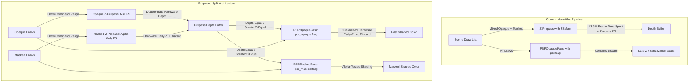

# Proposal: PBR Opaque vs. Masked Pipeline Separation

## Status
Proposed

## Context
In GPU execution profiles, [`pbr.slang`](file:///d:/Code/tempest/engine/runtime/render/system/shaders/raster/pbr.slang) fragment execution is the primary bottleneck, consuming **33.07% of total frame time**. A significant contributor to this overhead and associated memory stalls is the unified handling of opaque and alpha-tested (masked) materials within the same shader pipeline:

1. **Destruction of Hardware Early-$Z$ Writes**: In [`material.slang`](file:///d:/Code/tempest/engine/runtime/render/system/shaders/common/material.slang#L87) line 87 and [`pbr.slang`](file:///d:/Code/tempest/engine/runtime/render/system/shaders/raster/pbr.slang#L59) line 59, the fragment shader executes `discard` when `mat.type == MaterialType::MASK`. Because `discard` is present in the shader code, GPU hardware must restrict or disable Early-$Z$ depth writes for **all** geometry drawn with this pipeline, forcing Late-$Z$ evaluation and causing thread serialization within warps.
2. **Depth Prepass Fragment Overhead**: In [`depth_prepass.cpp`](file:///d:/Code/tempest/engine/runtime/render/system/src/passes/depth_prepass.cpp), a fragment shader is attached to depth passes. In the capture, `FSMain` in [`zprepass.slang`](file:///d:/Code/tempest/engine/runtime/render/system/shaders/raster/zprepass.slang) consumed **13.91% of total GPU time**, because even opaque geometry evaluated fragment code containing descriptor loads, material address pointer dereferencing, and `fetch_diffuse()` calls.
3. **Shadow Cascade Double-Rate Depth Restriction**: In [`shadow_depth_opaque.slang`](file:///d:/Code/tempest/engine/runtime/render/system/shaders/raster/shadow_depth_opaque.slang), an empty fragment shader (`FSMain() {}`) is bound to the pipeline. While visually inert, Vulkan specifies that binding any fragment shader stage prevents the rasterizer from operating in hardware **Double-Rate / $Z$-Only** mode (which processes up to $2\times$ depth fragments per clock cycle on modern NVIDIA, AMD, and Intel architectures).

## Proposed Architecture



---

## Detailed Design

### 1. Indirect Draw Command Partitioning

[`renderer.cpp`](file:///d:/Code/tempest/engine/runtime/render/system/src/renderer.cpp#L226-L231) already maintains distinct tracked counters for sorted draw command ranges:
- `_opaque_draw_count`, `_opaque_draw_offset`
- `_alpha_masked_draw_count`, `_alpha_masked_draw_offset`
- `_transparent_draw_count`, `_transparent_draw_offset`

Currently, line 1173 merges opaque and masked geometry:
```cpp
const auto non_transparent_draw_count = _opaque_draw_count + _alpha_masked_draw_count;
```
Under the proposed architecture, `PBROpaquePass` and `PBRMaskedPass` are recorded as two distinct sub-passes within the Render Graph, each receiving their exact indirect draw range with zero CPU sorting overhead.

---

### 2. Depth Prepass and Shadow Cascade Pipelines (`VK_NULL_HANDLE` Fragment Stage)

For depth-only passes where all fragments are fully opaque, the graphics pipeline template omits the fragment shader stage entirely:

```cpp
// In depth_prepass.cpp & shadow_depth_pass.cpp
auto stages = array{vs}; // ONLY vertex shader; NO fragment stage

auto tmpl = graphics_pipeline_template{
    .shader_modules = span<const shader_module_handle>{stages.data(), stages.size()},
    .color_attachment_formats = {},
    .depth_stencil_attachment_format = rhi::data_format::depth32_float,
    .primitive_topology = rhi::primitive_topology::triangle_list,
    .rasterization_state = {
        .polygon_mode = rhi::polygon_mode::fill,
        .cull_mode = rhi::cull_mode::back,
        .front_face = rhi::vertex_winding_order::counter_clockwise,
    },
    .depth_stencil_state = {
        .depth_test_enable = true,
        .depth_write_enable = true,
        .depth_compare_op = rhi::compare_op::greater, // Reverse-Z
    },
};
```

In the Vulkan RHI backend (`device.cpp`), when `.shader_modules` contains only a vertex stage, `VkGraphicsPipelineCreateInfo::stageCount` is set to 1. This instructs the hardware rasterizer to engage double-rate depth mode and bypass pixel shader warp dispatch completely.

For `zprepass_masked_pipeline`, a lightweight shader [`zprepass_masked.frag`](file:///d:/Code/tempest/engine/runtime/render/system/shaders/raster/zprepass_masked.slang) is bound:
```slang
// zprepass_masked.slang
[shader("fragment")]
void FSMain(VertexOutput input) {
    Material* mat = (Material*)input.material_address;
    if (mat.base_texture_id >= 0) {
        float alpha = bindless_textures[(int)mat.base_texture_id]
                          .Sample(bindless_samplers[push_constants.linear_sampler_index], input.uv).a;
        if (alpha * mat.base_texture_factor.a < mat.alpha_cutoff) {
            discard;
        }
    } else if (mat.base_texture_factor.a < mat.alpha_cutoff) {
        discard;
    }
}
```
> [!IMPORTANT]
> `zprepass_masked` does not evaluate `fetch_diffuse()`, does not sample metallic-roughness maps, and does not execute `iec_srgb_to_linear()`. It samples **only** the alpha channel of the base texture.

---

### 3. Dedicated `pbr_opaque.slang` (Zero Discard)

`pbr_opaque.slang` removes all `MaterialType::MASK` branches and `discard` statements:

```slang
// pbr_opaque.slang
[shader("fragment")]
[earlydepthstencil]
FragmentOutput FSMain(VertexOutput input) {
    SceneGlobals* scene = (SceneGlobals*)push_constants.scene_constants_address;
    Material* mat = (Material*)input.material_address;

    MaterialState mat_state;
    mat_state.mat = mat;
    mat_state.linear_sampler = bindless_samplers[push_constants.linear_sampler_index];

    PixelData pd;
    pd.uv = half2(input.uv);
    pd.geom_tangent = half3(input.tangent);
    pd.geom_bitangent = half3(input.bitangent);
    pd.geom_normal = half3(input.normal);
    pd.front_face = input.is_front_face;
    pd.ambient_occlusion = 1.0h;

    fetch_pixel_data_opaque(mat_state, pd);

    float sun_shadow = 1.0;
    if (push_constants.shadow_atlas_index >= 0 && push_constants.directional_shadow_address != 0) {
        DirectionalShadowData* shadow_data = (DirectionalShadowData*)push_constants.directional_shadow_address;
        float view_depth = -input.view_position.z;
        Texture2D shadow_atlas = bindless_textures[push_constants.shadow_atlas_index];
        sun_shadow = sample_csm_shadow(shadow_atlas, mat_state.linear_sampler, shadow_data, 
                                       input.world_position, input.normal, view_depth);
    }

    float4 color = evaluate_material_openpbr(
        pd, mat_state, scene,
        input.world_position, input.view_position, input.position.xy,
        sun_shadow, push_constants.light_bitmask_address);

    return FragmentOutput(color);
}
```

#### Depth-Test State in `PBROpaquePass`
Because the depth prepass has already populated the Reverse-$Z$ depth buffer:
- `depth_test_enable = true`
- `depth_write_enable = false`
- `depth_compare_op = rhi::compare_op::greater_or_equal` (or `equal`)

Any occluded pixel is rejected before `FSMain` is invoked, completely bypassing expensive BxDF and shadow calculations.

---

## Expected Performance Gains

| Optimization Component | Pre-Optimization Bottleneck | Expected GPU Yield |
| :--- | :--- | :--- |
| **Opaque Z-Prepass Null FS** | 13.91% frame time in `zprepass.slang` FSMain | $\approx 10-12\%$ total frame time recovered |
| **Opaque Shadow Cascades Null FS** | Empty FS bound in `shadow_depth_opaque.slang` | $\approx 1.5-2\times$ faster shadow rasterization |
| **Elimination of `discard` in PBR** | 2,221 samples in `material.slang` line 87 | Eliminates warp serialization & Early-$Z$ stalls |
| **Masked Prepass Specialization** | Redundant MR map sample & sRGB in prepass | 90% reduction in masked prepass ALU/bandwidth |
