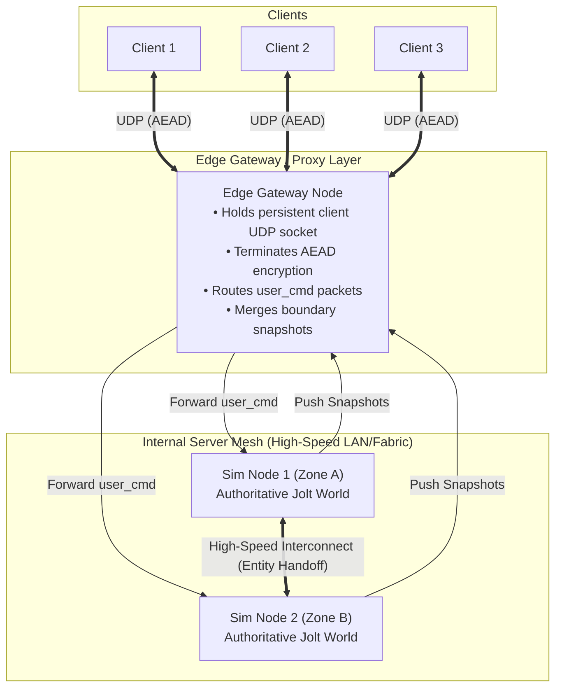
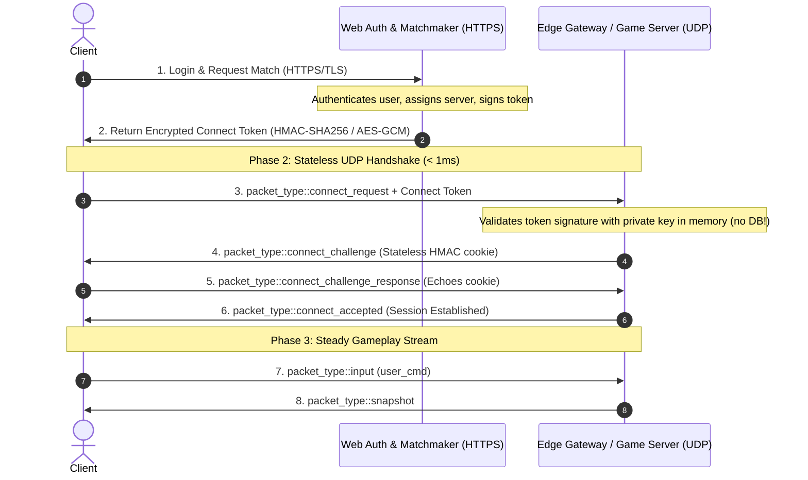

# Proposal: Production Multiplayer Architecture — Large Worlds, Multi-Server Meshing, Secure Sessions & Anti-Cheat

## Status
Proposed (Subsystem Architectural Extension to Macro Milestone 2 & 3)

## Context
Macro Milestone 2 establishes client-server prediction, non-blocking UDP transport, and reconciliation on a single dedicated server. However, shipping a production-grade multiplayer game requires solving four fundamental challenges that break naive networking implementations:
1. **Large Worlds**: Coordinate jitter beyond standard floating-point limits and massive bandwidth costs.
2. **Multi-Server Meshing & Edge Routing**: Scaling beyond the CPU limits of a single simulation server ($\approx 50\text{–}200$ players) to hundreds or thousands of concurrent players with seamless boundaries.
3. **Production Authentication & Scaled Session Lifecycle**: Preventing simulation hitching during login, handling DDoS, and validating connect tokens.
4. **Wire Security, Anti-Tamper & Anti-Cheat**: Preventing packet sniffing, man-in-the-middle payload tampering, replay attacks, and state injection.

This document details the architectural roadmap required to transition Tempest's custom UDP networking stack into a production-grade, distributed, and secure multiplayer infrastructure.

---

## 1. Large Worlds: Chunk-Relative Spatial Quantization & Interest Management

### The Problem
- 32-bit IEEE-754 floats have 24 bits of mantissa ($\approx 7$ decimal digits). At $10\text{km}$, precision drops to $1\text{mm}$; at $100\text{km}$, precision degrades to $1\text{cm}$, creating physics instabilities and visual vertex tearing.
- Replicating global 64-bit coordinates (`double`) across dozens of entities per frame saturates client bandwidth.

### Production Solution
```
[World Grid: 3D Chunk Indices (int32_t cx, cy, cz)]
                         │
         ┌───────────────┴───────────────┐
         ▼                               ▼
Chunk A (1024m x 1024m)         Chunk B (1024m x 1024m)
Origin: (0, 0, 0)               Origin: (1024, 0, 0)
Local Pos: 16-20 bit fixed-point  Local Pos: 16-20 bit fixed-point
(< 1mm precision)               (< 1mm precision)
```

1. **Chunk-Relative Position Compression**:
   - The global world is gridded into spatial chunks (e.g. $64\text{m}$ to $1024\text{m}$).
   - The replication system communicates chunk coordinates (`chunk_x, chunk_y, chunk_z`) infrequently (only when crossing chunk boundaries).
   - Dynamic entity positions are serialized relative to the entity's current chunk origin using $16\text{–}20$ bit fixed-point quantization, guaranteeing $< 1\text{mm}$ error while saving $> 60\%$ bandwidth compared to 64-bit floats.
2. **Spatial Interest Management (Area of Interest - AoI)**:
   - The server partitions the world into a spatial grid/quadtree.
   - Clients only receive snapshots for entities within their visibility/interest radius (e.g. $250\text{m}$). Entities outside AoI are culled before snapshot serialization.

---

## 2. Multi-Server Scaling: Edge Routing & Seamless Server Meshing

### The Problem
A single dedicated server running authoritative Jolt physics simulation at 60 Hz is fundamentally CPU-bound, capable of simulating at most $50\text{–}200$ active character controllers and rigid bodies before exceeding the $16.6\text{ms}$ frame budget.

### Production Solution: Edge Gateway & Server-to-Server Handoff



1. **Edge Gateway (Session Proxy)**:
   - Clients do **not** connect directly to the backend simulation worker.
   - Clients connect to an **Edge Gateway** (e.g. Valve Steam Datagram Relay / Star Citizen Gateway pattern).
   - The Gateway maintains the persistent UDP socket and encryption session with the client.
2. **Seamless Zone Transitions (Server Meshing)**:
   - When a player moves from Zone A (simulated by Node 1) to Zone B (simulated by Node 2):
     1. **Entity Transfer**: Node 1 serializes the player ECS entity state and transfers authoritative ownership to Node 2 over a private 10Gbps interconnect.
     2. **Gateway Rerouting**: The Gateway redirects the client's `user_cmd` stream to Node 2.
     3. **Zero Client Reconnect**: The client socket never rebinds, never re-authenticates, and experiences zero loading screens.
   - During the boundary overlap region, the Gateway merges snapshots from both Node 1 and Node 2 so entities in both zones remain visible.

---

## 3. Production Authentication & Scaled Session Lifecycle

### The Problem
Authentication, database queries, and account validation must never occur synchronously on simulation workers, as any I/O hitch stalls the physics loop for all players.

### Production Solution: Connect Token Protocol (`netcode.io` Standard)



1. **Out-of-Band Web Authentication**:
   - Identity verification and matchmaking take place over HTTPS microservices.
   - The matchmaker generates an **Encrypted Connect Token** signed with a cluster private key.
   - The token contains: `(client_id, server_address, expire_timestamp, sequence_nonce, ephemeral_shared_key)`.
2. **Stateless UDP Handshake**:
   - The game server validates the token cryptographically in $< 1\mu\text{s}$ without calling external databases.
   - A challenge cookie phase prevents IP spoofing and amplification attacks.
3. **Connection Watchdog & Clean Teardown**:
   - Redundant `packet_type::disconnect` bursts notify peers immediately.
   - An activity watchdog transitions stale connections to `timed_out` if no packets arrive within 5 seconds, triggering ECS entity cleanup.

---

## 4. Transport Security & Anti-Cheat

### The Problem
Unencrypted UDP packets on the public internet can be intercepted, forged, or replayed by packet injection tools (e.g. Wireshark, Wpacket, clumsy) to teleport characters, alter inventory, or spoof server state.

### Production Solution

#### 1. Wire Protocol AEAD Encryption (ChaCha20-Poly1305 / AES-128-GCM)
* **Associated Data (AAD)**: The `packet_header` (magic, version, sequence number, packet type, session ID) is sent in cleartext for fast router and proxy processing, but included in the cryptographic MAC computation. Tampering with sequence IDs or types invalidates the MAC.
* **Ciphertext Payload**: The entire bitstream payload is encrypted using the session's ephemeral shared key established during token handshake.
* **Tamper Rejection**: Any modified packet fails MAC validation and is dropped at the socket layer before touching engine memory.
* **Anti-Replay**: The 32-bit sequence number combined with the sliding 32-bit ACK bitfield rejects replayed packets.

#### 2. Authoritative Server Anti-Cheat (By Design)
* **Zero Client State Replication**: Clients never replicate positions, velocities, health, or combat results to the server.
* **Inputs Only**: Clients transmit only `user_cmd` inputs (move intent, look angles, button states, timestamps).
* **Physics Enforcement**: The server executes the movement step through Jolt physics. Clients cannot fly, teleport, or move through geometry, because the server simply will not simulate them there.

---

## Roadmap: Phased Integration into Tempest

| Phase | Milestone | Deliverable | Scope |
| :--- | :--- | :--- | :--- |
| **Phase 1** | **Micro 2.2** (Current) | Core Transport & Simulator | Non-blocking socket, bitstream quantization (chunk-relative hooks), sequence wrapping ACK tracker, latency/jitter simulator, 64-bit session ID, and extended packet types. |
| **Phase 2** | **Micro 2.3 & 2.4** | Prediction & Authority | `user_cmd` input ring buffer, Jolt client prediction, server state snapshots, discrepancy check, rollback resimulation, and visual error decay. |
| **Phase 3** | **Macro 3** | Large Worlds & Spatial AoI | Deterministic terrain heightfields, chunk grid coordinate indexing, and spatial interest culling. |
| **Phase 4** | **Future Extension** | Production Security & Handshake | Encrypted connect token parsing, HMAC challenge/response handshake, and ChaCha20-Poly1305 AEAD payload cipher. |
| **Phase 5** | **Future Extension** | Distributed Edge Routing | Edge Gateway proxy daemon, multi-server ECS entity handoff protocol, and dynamic zone meshing. |
