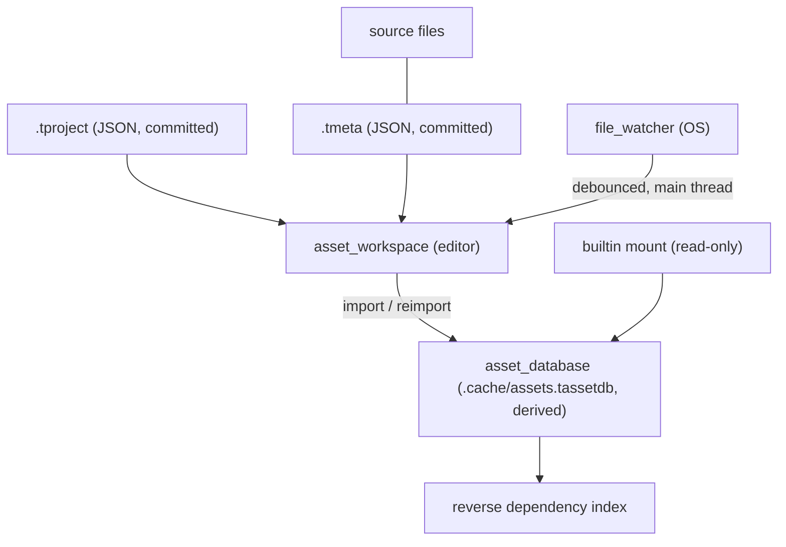

# Proposal: Project & Asset Workspace

## Status
Proposed. Child of [Editor & Scene System](editor_and_scene_system.md), Milestones M3 and M8 (removal flow).

## Context
Components refer to assets by `guid`. Today:

- Those guids are only stable while the binary `.tassetdb` persists, and the runtime never calls `asset_database::open()` or `save()`.
- There is no project concept and no sidecar metadata.
- Nothing watches the file system.
- Procedural meshes and materials get random guids that cannot be resolved.

Requirements covered: Editor 4–7 and Scene 3/4 (asset resolution) and 7b (prefabs in the asset database).

---

## Proposed Architecture



## Detailed Design

### 1. Project File
`<name>.tproject` (JSON) defines the project root:

```json
{
  "format": "tempest.project", "format_version": 1,
  "name": "Tempest Game",
  "engine_schema_hash": "…",
  "mounts": [ { "alias": "", "path": "assets", "priority": 0 } ],
  "scenes": [ "assets/scenes/main.tscene", "assets/scenes/main_menu.tscene" ],
  "startup_scene": "assets/scenes/main_menu.tscene",
  "bake": { "output": "dist", "always_include": [] },
  "editor": { "log_capacity": 100000 }
}
```

The editor opens a project from the command line (`--project=<path>`) or with File > Open Project. `.cache/` under the project root is git-ignored and holds the derived asset database, the editor session state (`editor_session.json`) and logs.

### 2. `.tmeta` Sidecars
Each imported source file has a committed sidecar `<file>.tmeta`:

```json
{
  "format": "tempest.meta", "format_version": 1,
  "source_guid": "…",
  "importer": "gltf", "importer_version": 3,
  "settings": { "generate_tangents": true },
  "sub_assets": {
    "prefab": "…",
    "mesh/0": "…", "mesh/1": "…",
    "material/0": "…",
    "texture/baseColor": "…"
  }
}
```

- Sub-asset keys are deterministic paths produced by the importer. A re-import reuses the guids recorded for each key and only creates new guids for new keys. This is what makes references stable across machines.
- **Imported** = the file has a `.tmeta`. **Loose** = it has no `.tmeta`.
- The `.tassetdb` becomes a pure cache. If it is deleted, the editor rebuilds it from the sources and `.tmeta` files on the next open.
- The db version mismatch path (`asset_database.cpp:443`) becomes "rebuild cache" rather than "reject".

### 3. Built-in Assets & Authorable Materials
- A read-only `builtin` mount ships engine primitives with fixed, well-known guids: plane, box, sphere, capsule, cylinder, the default material, and the missing-asset placeholder (magenta checker). The guids live in `tempest/builtin_assets.hpp` as `constexpr guid` values.
- `.tmaterial` (JSON): `{ "shading_model": "openpbr", "params": { … }, "textures": { "base_color": "<guid>" } }`. The editor can create and edit it through reflection-like descriptors. It is registered as a `core::material` asset type.
- **Transient assets.** Any asset registered at runtime under a guid unknown to the database is transient. Save validation warns about it; bake rejects it.

### 4. File Watching
- A `file_watcher` abstraction lives in `core`:
  - Windows: `ReadDirectoryChangesW`, with overlapped I/O on a dedicated watcher thread owned by the instance.
  - Linux: `inotify`.
- Events are coalesced per path with a 250 ms debounce and published to an `mpsc` queue. The editor drains the queue on the main thread each frame and calls `asset_database::notify_file_changed`.
- A full `scan_and_index` runs when a project opens.
- Changes to tracked files are handled as follows:

| Change | Handling |
| :--- | :--- |
| Source modified | Re-import, keeping guids. Loaded meshes, materials and textures are hot-swapped. Model prefabs propagate as described in [Scene & Prefab Format](scene_prefab_format_and_bake.md). |
| Source deleted | Remove its database entries and the orphan `.tmeta`. If the asset was referenced, log a warning; references become dangling and show the placeholder (requirement 7b). |
| `.tmeta` deleted while source remains | The source becomes loose. Its references become dangling until it is re-imported. |
| Rename or move | Recognised as a delete plus a create with an identical content hash inside the debounce window. The file is re-associated with its existing guid, and its `.tmeta` moves with it. |

### 5. Reverse Dependency Index & Asset Removal
- `asset_ref` is a reflected field kind, so references are discovered generically.
- The derived cache holds a project-wide index: `asset guid → [{owner: scene/prefab guid, id_path, component, field}]`. It is rebuilt on project open and updated incrementally on every scene or prefab save and on every import.
- **Removal flow** (editor, from the Project View):
  1. Look up references across *all* project scenes and prefabs.
  2. If there are none, delete the `.tmeta` and its database entries. A checkbox optionally also deletes the source file.
  3. If there are references, show a dialog listing them, with the options **Abort**, **Remove referencing entities** and **Leave dangling**.
  4. **Remove entities:**
     - In loaded scenes, the entities are removed through undoable `editor_command`s.
     - Unloaded scenes and prefabs are patched on disk only after a second confirmation listing each affected file. Those patches are not undoable; the dialog says so.
  5. **Leave dangling:** the references stay. Save validation reports them, and they render as the placeholder.

## Public API Surface & Subsystem Invariants
- The guid of every imported sub-asset is determined entirely by committed files (`.tmeta`). The cache can always be thrown away.
- `file_watcher` owns its thread and joins it in its destructor (RAII). No globals.
- Asset-database mutation from watcher events happens only on the main thread.

## Verification Plan

**`assets-tests`**
- `.tmeta` creation on import.
- Re-import keeps every existing sub-asset guid and adds new keys.
- Rebuilding the cache from sources and metas reproduces an identical guid set.
- Deleting a source removes its entries and the orphan meta.
- Rename detection by content hash.
- Built-in guids resolve without any project.
- `.tmaterial` round-trip.
- Reverse index correctness after saving a scene that references meshes, materials and textures, including nested prefabs.

**`core-tests`**
- `file_watcher` reports create, modify, delete and rename in a temp directory.
- Debounce coalesces a burst of 50 writes into one event.
- The destructor joins cleanly.

**TSan**
- `core-tests` (file_watcher thread → mpsc queue).

**Manual**
- Delete an imported texture in Explorer while the editor is open. The placeholder appears and a warning is logged.
- Run the removal dialog's three options against a referenced material.

## Implementation Phases
| Phase | Subsystem | Description |
| :--- | :--- | :--- |
| M3.1 | assets | `.tproject`, `.tmeta`, cache-only `.tassetdb`, deterministic sub-asset keys |
| M3.2 | assets / render-system | Built-in mount, `.tmaterial`, transient detection |
| M3.3 | core / editor | `file_watcher`, debounced main-thread draining, re-import hot-swap |
| M8 | editor / assets | Reverse dependency index and the removal dialog flow |
