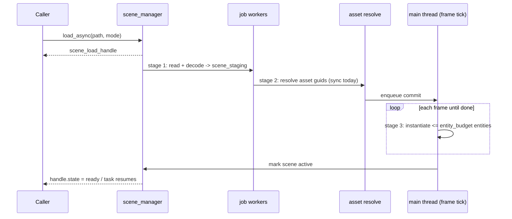

# Proposal: Scene Manager & Multi-Scene Loading

## Status
Proposed. Child of [Editor & Scene System](editor_and_scene_system.md), Milestone M4.

## Context
The engine context owns exactly one `ecs::archetype_registry` and has no concept of a world, scene or level. Requirement 8 asks for several scenes loaded at once: additive loading, replace-all ("single") loading, unloading, and both sync and async modes, with async acting as the seam for future asset streaming. The registry may only be touched from the main thread. The job system provides coroutines (`job::task<T,E>`), but it has no main-thread resume awaiter and no asynchronous file I/O.

---

## Proposed Architecture



## Detailed Design

### 1. One World Registry, Many Scenes
- `scene_manager` is owned by the engine context, after `_entity_registry`. It holds a non-null `archetype_registry`, `prefab_cache`, `asset_database` and `job_system`.
- **Handles.** `scene_handle` is a generational `{uint32_t index; uint32_t generation;}` into a slot table of `scene_record`s. Each record holds the guid, source path, state, dirty flag and load report.
- **Membership.** Every entity authored in a scene carries `scene_entity_component{scene, local_id}`. Dynamic entities created at runtime carry none, unless they were spawned into a scene with `spawn_into(scene)`.
- **Unload.** Collect the entities whose `scene_entity_component.scene == handle`, then destroy them with `destroy_recursive`. Entities that are not part of that scene but are parented under it (dynamic children) are destroyed along with their parent.
- **Single mode.** A load in single mode unloads every active scene *after* the new scene's commit finishes, so the world never goes empty for a frame. The exception is a `clear_first` flag, used when memory is tight.

```cpp
namespace tempest::scene
{
    enum class load_mode : uint8_t { additive, single };
    enum class load_state : uint8_t { queued, decoding, resolving, committing, ready, failed, cancelled };

    struct load_options
    {
        static constexpr uint32_t default_entity_budget = 2048;

        load_mode mode = load_mode::additive;
        uint32_t entities_per_frame = default_entity_budget; // ignored by load_sync
        bool clear_first = false;
    };

    class scene_manager
    {
      public:
        auto load_sync(string_view project_path, load_options options) -> expected<scene_handle, scene_error>;
        auto load_async(string_view project_path, load_options options) -> scene_load_handle;
        auto unload(scene_handle scene) -> void;
        auto unload_all() -> void;

        auto save(scene_handle scene) -> expected<scene_save_report, scene_error>;   // editor
        auto create_empty(string_view project_path) -> scene_handle;                 // editor

        [[nodiscard]] auto active_scenes() const -> span<const scene_handle>;
        [[nodiscard]] auto find(guid scene_guid) const -> optional<scene_handle>;

        auto tick() -> void; // main thread, once per frame: drives commit stages
    };

    class scene_load_handle
    {
      public:
        [[nodiscard]] auto state() const noexcept -> load_state;
        [[nodiscard]] auto progress() const noexcept -> float;
        [[nodiscard]] auto wait() -> job::task<expected<scene_handle, scene_error>>;
        auto cancel() -> void;
    };
}
```

### 2. Three-Stage Pipeline
1. **Decode (job workers).** Read the file, parse the JSON (`.tscene`) or validate the header (`.tscenebin`), resolve prefab templates (loading any missing ones into the cache), and produce an immutable `scene_staging`. The staging object holds flat records in commit order plus the list of referenced asset guids. No registry access happens in this stage.
2. **Resolve assets.** Make sure every referenced guid is loaded in the mesh, material and texture registries. Today this runs synchronously: requests are marshalled to the main thread through an `mpsc_mailbox`, because those registries are not thread-safe. This stage is the defined seam for future streaming, where it would issue requests and complete later.
3. **Commit (main thread, `tick()`).**
   - Create entities from the staging records, at most `entities_per_frame` per tick.
   - After the last batch: patch `entity_ref`s, link relationships, and run `post_load`.
   - Then set the scene's state to `ready`.

**Visibility while loading.** Entities committed before `ready` carry `scene_inactive_tag`. Systems with gameplay effects (physics, game logic, rendering) exclude that tag. When the commit finishes, the tag is removed in one pass. Callers that only see the `ready` state therefore never observe a half-loaded scene.

**Synchronous loading.** `load_sync` runs all three stages inline on the calling thread, which must be the main thread, with an unlimited budget.

**Async completion.** `scene_load_handle::wait()` completes through a main-thread resume. A small `main_thread_executor` is added to the job system: an `mpsc` queue that `engine_context::run` drains every frame. That gives a real main-thread awaiter without any global state.

### 3. Editor Integration
- The editor can have any number of scenes active at once. Each has its own dirty flag and undo stack.
- The hierarchy pane groups root entities under a header row per scene.
- A new entity goes into the *active authoring scene*, which is selectable in the hierarchy.
- Scene-manager state is part of the play snapshot. Scenes loaded or unloaded while playing roll back on Stop.

### 4. Runtime (game executable)
- At startup the runner opens `content/assets.tassetdb` read-only, then calls `load_sync(startup_scene)` (from the baked `.tproject` manifest).
- After that, game code drives `load_async` and `unload`.

## Public API Surface & Subsystem Invariants
- **Thread safety.** Registry mutation only ever happens in `tick()` or `load_sync()` on the main thread. Staging objects are immutable once published.
- **No partial visibility.** `scene_inactive_tag` guarantees systems never see a half-committed scene.
- **No globals.** All state is owned by the `scene_manager` instance.
- **Unload order.** `scene_manager` is destroyed before the registry, which is destroyed before dynamic libraries unload (concurrency_runtime.md §2).

## Verification Plan

**`scene-tests` (non-GPU)**
- Sync load registers the scene as `ready`.
- Additive load of two scenes leaves both active, with disjoint membership.
- Unload removes exactly that scene's entities, plus any dynamic children.
- Single mode leaves only the new scene.
- With `clear_first` off, the old scene stays alive until the new one commits.
- An async load with budget 10 on a 1000-entity scene:
  - Commits over 100 ticks.
  - Never exposes untagged entities before `ready`.
  - Reports monotonic progress.
- `cancel()` during decode and during commit leaves no entities behind.
- A failed decode yields `failed` with a report.
- `wait()` resumes on the main thread (assert the thread id).

**TSan**
- `scene-tests` and `job-tests` run under `--use-tsan`, because this milestone touches the job system (main-thread executor) and a cross-thread mailbox.

**Manual**
- Load two scenes additively in the editor and unload one. The hierarchy, renderer and physics all update without a stall.

## Implementation Phases
| Phase | Subsystem | Description |
| :--- | :--- | :--- |
| M4.1 | job | `main_thread_executor` and its awaiter, drained in `engine_context::run` |
| M4.2 | scene | `scene_manager`, handles, membership, sync loading and saving |
| M4.3 | scene | Async pipeline, `scene_inactive_tag`, budgets, cancellation |
| M4.4 | engine | Wire into `standalone_engine_context`; filter systems on `scene_inactive_tag` |
