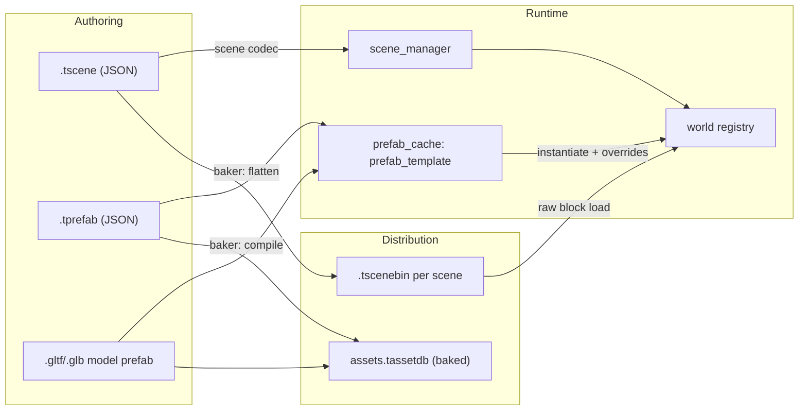

# Proposal: Scene & Prefab Source Format, Prefab Instancing, and Scene Baking

## Status
Proposed. Child of [Editor & Scene System](editor_and_scene_system.md), Milestones M1 (JSON writer), M4 (scenes), M5 (prefabs) and M9 (bake).

## Context
All world content is currently built procedurally (`game/game/src/entrypoint.cpp:624-748`). The only persisted entity data is the glTF importer's `entity_hierarchy` blob, which has these limitations:

- It stores raw component bytes (`memcpy`) keyed by a toolchain-dependent type hash.
- It drops entity names.
- It is instantiated with `registry.duplicate()`, so instances keep no link to the source.

Prefab templates are live entities tagged `prefab_tag`, and every system has to filter them out. The engine can read JSON through a yyjson wrapper (`core/json.hpp`) but has no JSON writer.

Requirements covered: Scene 1–7 and Editor 8.

---

## Proposed Architecture



## Detailed Design

### 1. JSON Writer Without Leaking yyjson

`core/json.hpp` gains a mutable document API. **No yyjson type, header or forward declaration appears in any public header.** The existing read-side wrapper is also audited and made opaque in the same way.

```cpp
namespace tempest::core
{
    class json_writer
    {
      public:
        explicit json_writer(abstract_allocator& allocator);
        ~json_writer();
        json_writer(json_writer&&) noexcept;
        auto operator=(json_writer&&) noexcept -> json_writer&;

        [[nodiscard]] auto root() -> json_object_mut;
        [[nodiscard]] auto to_string(json_write_options options) const -> expected<string, json_error>;

      private:
        struct impl;           // defined in json.cpp; owns yyjson_mut_doc*
        unique_ptr<impl> _impl;
    };
}
```

`json_object_mut` and `json_array_mut` are small value handles: an opaque `void*` node plus a `non_null<impl>` back-pointer. Their methods are defined in `json.cpp`.

Output is deterministic:

- Pretty-printed with 2-space indentation and `\n` line endings.
- Floats use shortest round-trip formatting.
- Keys are written in insertion order, and the codec fixes that order.

### 2. Entity Identity

- Each entity in a scene or prefab file has a `local_id`: a random 64-bit value, unique within that file, written as a 16-digit hex string. A string avoids losing precision in JSON tools.
- At runtime it lives in `scene_entity_component{scene_handle scene; uint64_t local_id;}`. That component is serializable only structurally, not as a regular component.
- `entity_ref` fields are written as the target's `local_id`, or as `null`, and remapped to live `ecs::entity` handles when the scene is committed.
- Cross-scene `entity_ref`s are rejected by save validation in v1.
- Entities inside a prefab instance are addressed by an `id_path`: an array of local ids starting at the outermost instance (for example `["a1f0…", "03c2…"]`).

### 3. `.tscene` Schema (v1)

```json
{
  "format": "tempest.scene",
  "format_version": 1,
  "guid": "6f1c2a9e-…",
  "entities": [
    {
      "id": "9b3e0c1d2f4a5b6c",
      "name": "Sun",
      "parent": null,
      "components": {
        "tempest::ecs::transform_component": { "version": 1, "position": [0, 10, 0], "rotation": [0, 0, 0, 1], "scale": [1, 1, 1] },
        "tempest::render_system::directional_light_component": { "version": 1, "color": [1, 0.95, 0.9], "intensity": 3.0 }
      }
    },
    {
      "id": "0c77ab12e9f04411",
      "name": "Crate",
      "parent": null,
      "prefab": {
        "guid": "d2a4…",
        "overrides": [
          { "target": [], "component": "tempest::ecs::transform_component", "field": "position", "value": [4, 0, 2] },
          { "target": ["03c2…"], "component": "tempest::core::material_component", "field": "material_id", "value": "8e1f…" }
        ],
        "added_components": [ { "target": [], "components": { "...": {} } } ],
        "removed_components": [ { "target": ["03c2…"], "component": "tempest::render_system::shadow_caster_component" } ],
        "added_children": [ "5d10e2aa00b3c4f1" ]
      }
    }
  ]
}
```

Ordering rules:

- Entities are written depth-first: a parent before its children, siblings in authored order. `parent` is the parent's local id.
- Components are sorted by normalized type name. Fields follow descriptor order.
- `asset_ref` values are guid strings. `fixed_string` values are JSON strings. Enumerations are written by entry name.

`.tprefab` has the same schema with `"format": "tempest.prefab"`. Exactly one root entity has `parent: null`, and that root has no `transform_component` in the file (requirement 7c). If an instance has no transform override, it defaults to identity.

### 4. Prefab Model

**Templates.** `prefab_template` is an immutable flat array of records `{local_id, parent_index, name, components: [(type_id, bytes)], nested_instance?}`. Templates are stored in `prefab_cache`, which is owned by the engine context and keyed by prefab guid. The world registry never holds template entities, so `prefab_tag` and its filtering in the hierarchy, renderer and physics are removed.

**Sources:**

- `.tprefab` files.
- Read-only **model prefabs** generated from `.gltf`/`.glb` imports. Internal local ids are `fnv1a64(source_guid, node_path)`, so re-importing keeps overrides valid.

**Instantiation:**

1. Copy the records into the world registry.
2. Apply removed components, then overrides, then added components (in that order).
3. Attach added children.
4. Assign `prefab_instance_component{guid prefab; uint64_t instance_local_id;}` to the instance root, and `prefab_member_component{uint64_t template_local_id;}` to members.

**Overrides:**

- Overrides are per field. The editor computes them by diffing live reflected values against the template, using reflected field equality (float comparison is exact, so changes round-trip exactly).
- The root transform is always written.
- "Revert" restores the template value. "Apply to Prefab" writes the value into the `.tprefab` and removes the override.
- "Unpack" removes the instance and member components and writes the instance out as plain entities.

**Nesting:** templates may contain nested instances. A depth-first cycle check runs at save time. Override targets use `id_path`.

**Propagation:** when a `.tprefab` changes (saved or reported by the file watcher), the cache rebuilds the template. Loaded instances are then re-instantiated with their overrides re-applied. Entity handles for members are preserved when the `template_local_id` still exists.

### 5. Asset Resolution & Validation

**On load:**

- Every `asset_ref` is checked against the asset database.
- Unresolved guids are collected into a `scene_load_report` with entries `{scene, local_id path, component, field, guid}`.
- The editor shows one summary dialog and logs each entry. The load still succeeds, and dangling refs render as a "missing asset" placeholder.

**On save, validation reports:**

- Unresolved guids.
- Transient (runtime-only) guids.
- Cross-scene `entity_ref`s.
- Storage-only (unserializable) components.
- Unresolved opaque data.

Each category is a warning that can be dismissed, so the save still proceeds (decision Q12).

**Schema evolution:** unknown components and fields are kept as opaque JSON in an editor-side `unresolved_data` table keyed by `(scene, local_id)` and written back unchanged on save. Type aliases and `migrate()` hooks run before decoding (see [Component Reflection](component_reflection_type_registry.md)).

### 6. Baked Scene Binary (`.tscenebin`)

```text
header      { magic "TSCN", format_version u16, flags u16, schema_hash u64, section_count u32 }
section     { kind u32, offset u64, size u64 } * section_count
STRINGS     length-prefixed UTF-8 pool
TYPES       [ { name_str, name_hash u64, size u32, align u32, entity_ref_offsets[] } ]
ENTITIES    count u32, names (string idx), parent_index (u32, ~0 = root), first_child/next_sibling indices
ARCHETYPES  [ { type_indices[], entity_indices[], per-type packed component byte blocks } ]
ASSETS      [ guid ]  (every asset_ref in the scene, for streaming/preload)
```

- **Flattening.** Prefab instances are fully flattened (overrides applied) and nested instances expanded. Only serializable components are stored.
- **Loading.** Each archetype block is `memcpy`'d into archetype storage. `entity_ref` offsets are patched from scene indices to live handles. `post_load` runs for each type that has one. Relationships are rebuilt from the ENTITIES section.
- **Compatibility.** `format_version` **and** `schema_hash` must match exactly. On mismatch the loader returns `scene_error::schema_mismatch`, with a per-type diff computed from the TYPES section against the live registry.
- **Isolation.** A scene binary never embeds asset blobs. Assets come only from the baked asset database.

### 7. Bake Pipeline
- A `bake` static library is used by the editor ("Build > Bake Project") and by a new headless `tempest-bake` executable.
- **Inputs:** a `.tproject`. Its scene list defines the roots.
- **Outputs:**
  - `<out>/content/assets.tassetdb`: source entries stripped, and only assets reachable from the scene list plus those marked `always_include`. Prefabs are compiled to `prefab_template` blobs.
  - `<out>/content/scenes/<scene>.tscenebin`, one per scene.
- **Failure policy:** bake fails hard on unresolved assets, unresolved opaque data, transient guids, or storage-only components in scene entities.

## Verification Plan

**`core-tests` (json)**
- Writer round-trip for every value kind.
- Deterministic output: write → parse → write produces byte-identical output.
- A grep of `engine/runtime/core/include` for `yyjson` returns nothing (enforced as a test step in CI).

**`scene-tests` (new, non-GPU)**
- Save → load → save produces byte-identical JSON (requirement 3b).
- Live registry equality after a round-trip, compared field by field via reflection, including names, hierarchy and sibling order.
- `entity_ref` remapping.
- Unknown component and field preservation.
- Migration hooks run in order.
- Alias resolution.
- Validation report contents for each failure category.
- Prefab tests:
  - Instantiation applies overrides, added and removed components, and added children.
  - Nested prefabs with `id_path` targets.
  - A cycle is rejected.
  - Template propagation preserves member handles.
  - The root transform is never persisted in `.tprefab`.
  - Model-prefab ids are stable across two imports of the same glTF.

**`bake-tests` (new, non-GPU)**
- Bake → load produces registry equality with the JSON load.
- `schema_hash` mismatch is rejected with a diff.
- `format_version` mismatch is rejected.
- Reachability pruning of the asset database.
- Bake fails on each hard-failure category.

**Manual**
- Edit a `.tprefab` with an instance placed in an open scene. Instances update and overrides survive.

## Implementation Phases
| Phase | Subsystem | Description |
| :--- | :--- | :--- |
| M1 | core | Opaque `json_writer`, plus making the read wrapper opaque |
| M4 | scene | `.tscene` codec, local ids, validation report, unresolved-data preservation |
| M5 | scene / assets | `prefab_template`, `prefab_cache`, `.tprefab`, overrides, nesting, model prefabs, removal of `prefab_tag` |
| M9 | bake | `bake` library, `tempest-bake`, `.tscenebin` writer and loader, baked asset database |
